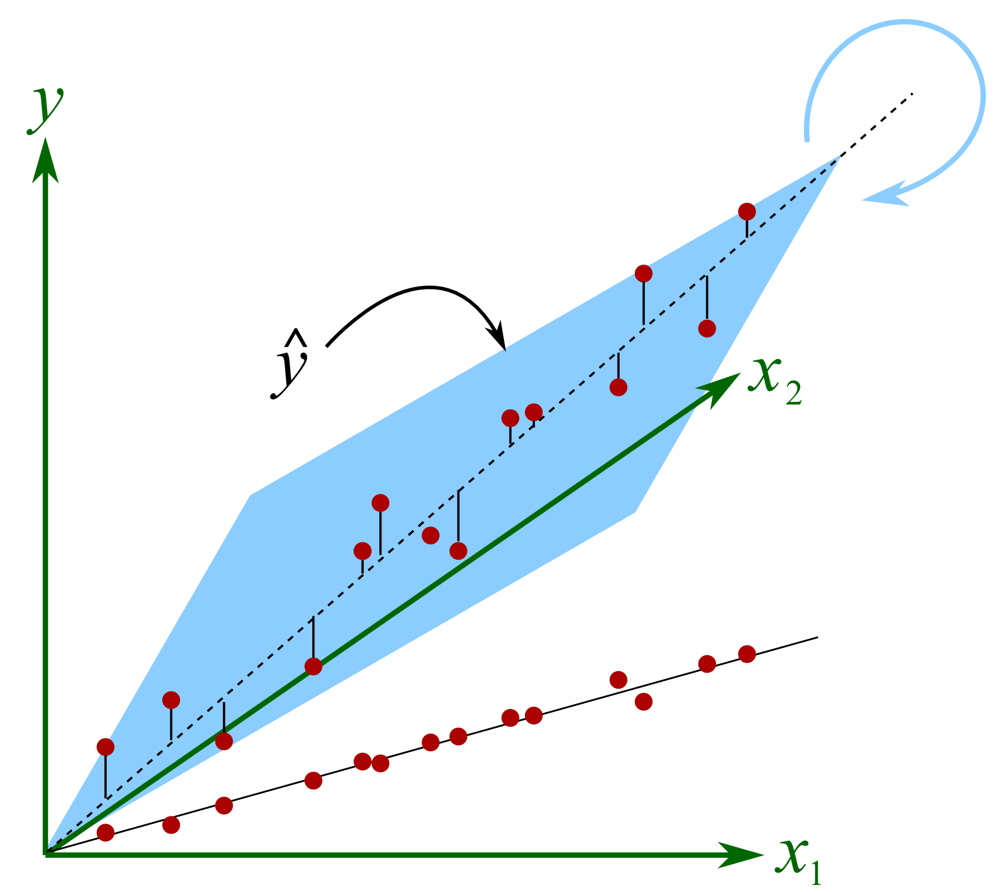

  

 In this project I implemented <b>L2 regularized principal component analysis (PCA)</b> in <code>python</code> by only using <code>numpy</code>. The PCA algorithm is then applied to the Breast Cancer Wisconsin (BCW) data set to reduce the number of variables needed to give an accurate breast cancer diagnosis. 

 There's probably mistakes here and there, but given that at the time I was a Psychology PhD student in my first year and quite unfamiliar with python, I am pretty happy with how the project turned out and that's why I keep it here.

 <embed src="https://raw.githack.com/quinix45/Numpy_only_regularized_PCA/main/Report-final-project.pdf" width="730" height="520" 
 type="application/pdf"> 

---

