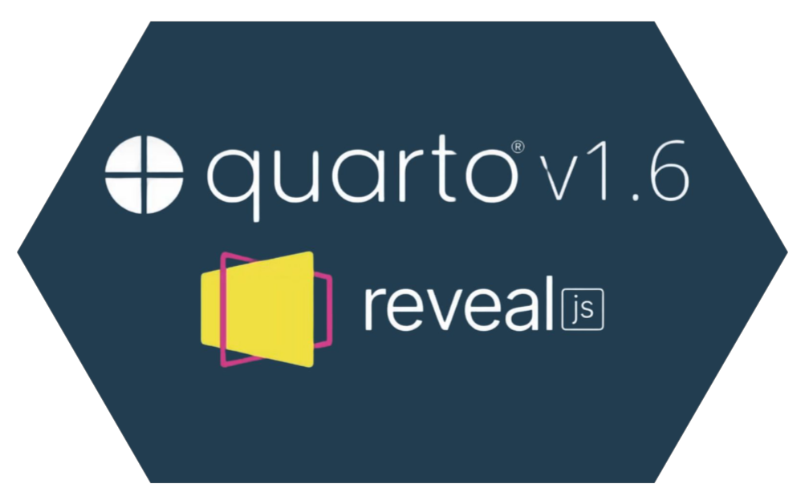

  

 
 

 In my teaching, I usually find myself needing to teach students both statistics and the R programming language. To this end, I have used <a href="https://en.wikipedia.org/wiki/Beamer_(LaTeX)" target="_blank" class="inline-link">Beamer slides</a> in the past, but I have always been unhappy with the lack of customization and the rigidity of the framework. 

 I found the <a href="https://revealjs.com" target="_blank" class="inline-link">revealjs</a> framework and the seemless integration with <a href="https://quarto.org/docs/presentations/" target="_blank" class="inline-link">quarto</a> much more flexible for my needs. For example, revealjs, being an html framework, allows to include interactive elements (e.g., shiny apps, interactive 3D plots) right on the slides! 

Check out <a href="https://github.com/quinix45/Fabio_Theme" target="_blank" class="inline-link"> my custom theme</a> that I use for both my presentations and lectures. I have added many features that improve both accessibility and quality of life for both students and presenters! If you like this theme, you are more than welcome to use it!!

**Slides Demo:** <a href="https://raw.githack.com/quinix45/Fabio_Theme/main/Theme_tester.html" target="_blank" class="inline-link"> https://raw.githack.com/quinix45/Fabio_Theme/main/Theme_tester.html </a>

