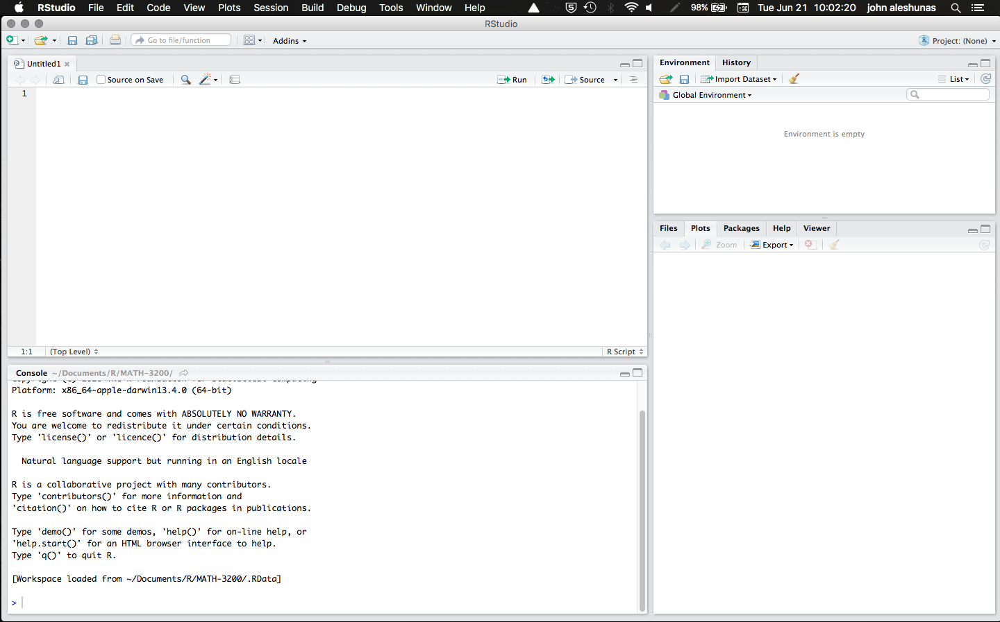
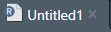
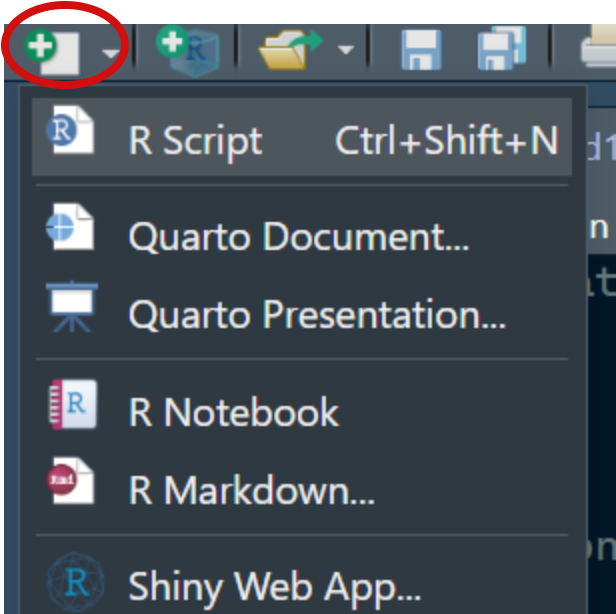
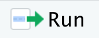
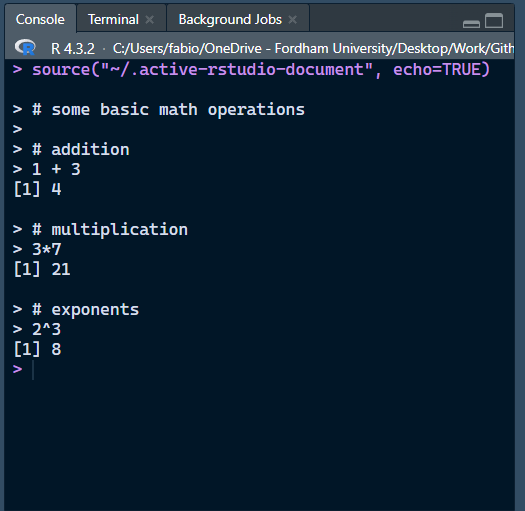
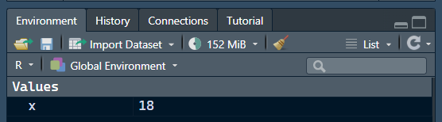
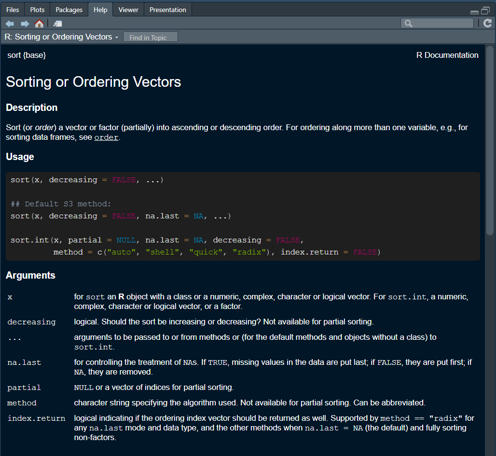
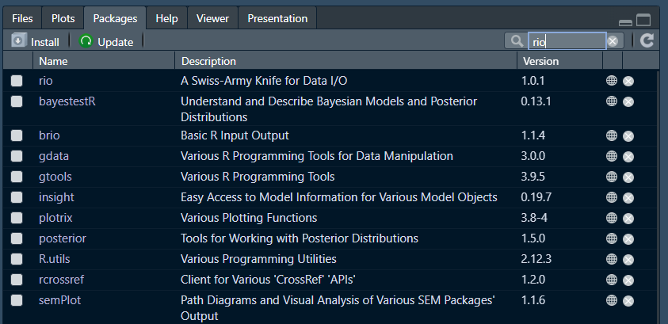

## R and Rstudio? 

:::: {.columns}
::: {.column width="50%"}

<center>

To start, it's good to point out that **R** and **RStudio** are two different things

R:

{width=30%}

RStudio:

{width=30%}

</center>

:::
::: {.column width="50%"}


:::
::::


## What is R?

{.absolute top=-35 right=-50 width="120" height="80"}


<p style="font-size:32px;"> **R** ([https://www.r-project.org/about.html](https://www.r-project.org/about.html){target="_blank"}) is a *programming language* originally designed for statistical computing and data visualization. </p>

:::{.fragment .fade-in fragment-index="1"}
<p style="font-size:32px;"> Thanks to the contribution of many users, nowadays R is quite similar to python ([https://www.python.org](https://www.python.org){target="_blank"}) in what it allows you to do. </p>
:::


:::: {.columns}
::: {.column width="50%"}

</br>
</br>

<center>

<p style="font-size:32px;"> There exist *many* programming languages and some do something better than others. </p>

</br>

<p style="font-size:32px;"> R works pretty well for data analysis and visualization and that's why we use it 🤷 </p>

</center>


:::
::: {.column width="50%"}


<figure>
  
  <figcaption>Some popular programming languages</figcaption>
</figure>


:::
::::

## What is RStudio?

{.absolute top=-35 right=-50 width="120" height="100"}
<p style="font-size:32px;"> Whereas R is a programming language, **RStudio** is an *integrated development environment* (IDE...a what? 😕) </p>

</br>


:::: {.columns}
::: {.column width="50%"}

:::{.fragment fragment-index="1"}
<p style="font-size:32px;"> An IDE is software that facilitates writing code in general. Although **RStudio** was developed with **R** in mind, it also supports many other programming languages (e.g., Python, Javascript, C...) </p>
:::


:::


::: {.column width="50%"}

:::{.fragment fragment-index="2"}
<p style="font-size:32px;"> Likewise, you do not need **RStudio** to use **R**. However, **RStudio** is by far the best IDE for coding in **R** and it makes the process much more efficient! </p>
:::

:::
::::

</br>

<p style="font-size:32px;">
The people who make RStudio ([https://posit.co/download/rstudio-desktop](https://posit.co/download/rstudio-desktop){target="_blank"}) have no affiliation with the people who make R as far as I know. 
</p>

## Coding 

To use R properly you will have to learn how to *code* (which may sound a bit scary 😟). Coding is like learning a foreign language: There is grammar and there is a logic to how you construct sentences. The exact same is true for programming *languages*. There is a lot I could say here, but just some advice:

:::: {.columns}

::: {.column width="33%"}

**Errors and Mistakes:** Your code (my code too!) will almost never work perfectly the first time around. Do not get frustrated; understand *why* your code does not work. Making mistakes over and over and fixing them is how your learn.

:::
::: {.column width="33%"}

**Understand Your Code:** Do not copy and paste code without understanding what it does. This may work for some of the assignments in this course, but it will eventually lead to *huge* mistakes when you are doing research on your own. 


:::

::: {.column width="33%"}

**Taking Shortcuts:** There are many shortcuts you can take to write code (e.g., chatGPT). I *strongly discourage* using AI assistance to write code <u>if you are new to coding</u>. AI code may be wrong (or it may not be what you want), and you first need to develop the knowledge to know when and why code is wrong. 

:::

::::


If you have code problems, I recommend Googling your question and looking for other humans who have answered it (usually on [https://stackoverflow.com](https://stackoverflow.com){target="_blank"})

## RStudio: What Am I looking at?

:::: {.columns}
::: {.column width="50%"}

The RStudio interface is divided into **4 panes**:


<ul style = "font-size: 26px;">

:::{.fragment .fade-in fragment-index="1"}
<li> **Source** (top-left): This pane is where we will do most of our work. Here is were you can edit and run your code files (*scripts*). </li>
:::

:::{.fragment .fade-in fragment-index="2"}
<li> **Environment** (top-right): This is where you can find the *objects* that are present in the current R session. </li>
:::

:::{.fragment .fade-in fragment-index="3"}
<li> **Console** (bottom-left): The console is actually R by itself (the R console) and it is how RStudio runs R. You will find *output*, *messages*, and *warnings* here.\* </li>
:::

:::{.fragment .fade-in fragment-index="4"}
<li>**Viewer** (bottom-right): This is a bit of a catch-all pane. Here, you will find plots, installed *packages*, help for *functions*, and your computer folders (under *files*)  </li>
:::


</ul>

:::{.fragment .fade-in fragment-index="4"}
<div style="font-size: 22px"> (You can customize where your panes are. I usually swap the position of the console and environment) </div>
:::


:::
::: {.column width="50%"}




:::{.fragment .fade-in fragment-index="3"}
:::{.callout-note}
## \*More about the "Console"
<p style="font-size:14px"> You can actually write and run code directly in the console, but you cannot save your code (which you should always do!). When you run your code from the Source pane, RStudio sends it to the console to be interpreted. All computer code is just plain text; what you need to run code of a certain computer language is to have something that interprets it and runs it. The R console is what interprets and runs your code (Hence why you need to have R on your computer to use R in RStudio) </p>
:::
:::

:::
::::


## Creating an R Script


:::: {.columns}
::: {.column width="50%"}
Before we can do any coding, we need to open a new R script! You can open a new R script by following the steps in the image on the right, or by using pressing **Cmd + Shift + N** (Mac) or **Ctrl + Shift + N** (Windows).


A tab named “Untitled1” will appear in your source pane. This is where we are going to write code for today!



As any other file, you can later save this file anywhere on your computer. It will have the *.R* extension.

<center>
**Save the file and name it "Lab_1_code"**
</center>


:::
::: {.column width="50%"}

<center>

{width="50%"}

</center>

:::
::::


## Running Code and Mathematical Operations

R can perform just about any mathematical operation. At the same time, let’s see how to run some code:

:::: {.columns}
::: {.column width="60%"}

:::{.fragment .fade-in fragment-index="1"}
<p style="font-size:32px;">  In RStudio, you can either run one or more line of code at once, or run the whole R script file at once. </p>
:::


<ul style = "font-size: 28px;">

:::{.fragment .fade-in fragment-index="2"}
<li> **One or more lines**: highlight the lines that you want to run and press **CTRL+Enter** (Windows) or **CMD+Return** (Mac) </li>
:::

:::{.fragment .fade-in fragment-index="3"}
<li> **Entire Script**: press **CTRL+Shift+Enter** (Windows) or **CMD+Shift+Return** (Mac). </li>
:::


</ul>


The {width="10%"} button will also run the next runnable line of code with respect to your cursor. 

:::{.fragment .fade-in fragment-index="4"}
<center> Copy the *code chunk* on the right into your R script and try running the full script. </center>
:::


:::
::: {.column width="40%"}


::: {.cell .code-125}

```{.r .cell-code  code-line-numbers="false"}
# some basic math operations

# addition
1 + 3

# multiplication
3*7

# exponents
2^3
```
:::


:::
::::


## Output


:::: {.columns}
::: {.column width="60%"}

You will see your code with output appear in the console.

:::{.fragment .fade-in fragment-index="1"}
*Output* is indicated by "[*n*]", where *n* represents the line of the output. 
:::

:::{.fragment .fade-in fragment-index="2"}
Here we only have one line for output each of our inputs (the 3 math operations), but you can have more lines. 
:::

</br>

:::{.fragment .fade-in fragment-index="3"}
The **#** sign represents comments. R will not run commented lines. Comments are good for explaining code to other people reading your code, and more importantly...to the future you!
:::


:::
::: {.column width="40%"}



:::
::::


## A Note on how R Interprets Code

R “reads” code until it find the end of a *statement* (code that produces output), and then expects the following statement to appear on a new line.


:::: {.columns}
::: {.column width="50%"}

For example:


::: {.cell .code-125}

```{.r .cell-code  code-line-numbers="false"}
# The line below is a statement and will produce output

(4 +5)*2
```

::: {.cell-output .cell-output-stdout}

```
[1] 18
```


:::
:::


However:


::: {.cell .code-125}

```{.r .cell-code  code-line-numbers="false"}
# The this will not run (2 statements on the same line)

(4 + 5)*2  6+6
```

::: {.cell-output .cell-output-error}

```
Error in parse(text = input): <text>:3:12: unexpected numeric constant
2: 
3: (4 + 5)*2  6
              ^
```


:::
:::


:::
::: {.column width="50%"}

Spacing among elements of a statement is irrelevant, but it is good practice to be reasonable and consistent.


::: {.cell .code-125}

```{.r .cell-code  code-line-numbers="false"}
# This is not good practice, but it will run.

( 4 +
  5 )*   2
```

::: {.cell-output .cell-output-stdout}

```
[1] 18
```


:::

```{.r .cell-code  code-line-numbers="false"}
6  +
   6
```

::: {.cell-output .cell-output-stdout}

```
[1] 12
```


:::
:::


:::
::::


## Operators

*Operators* are symbols that tell R to perform certain actions. Aside from the math operations, the `:` operator is a bit unique to R.

:::: {.columns}
::: {.column width="50%"}


| Operator | Description                  |
|----------|------------------------------|
| `+`      | addition                     |
| `-`      | subtraction                  |
| `*`      | multiplication               |
| `/`      | division                     |
| `^`      | exponentiation               |
| `x:y`    | sequence from x to y         |


:::
::: {.column width="50%"}

Although it may no appear so, `:` turns out to be very convenient in many cases


::: {.cell .code-125}

```{.r .cell-code  code-line-numbers="false"}
3:10
```

::: {.cell-output .cell-output-stdout}

```
[1]  3  4  5  6  7  8  9 10
```


:::
:::


There exist other operators and *logical operators* as well, but I will talk about them if they come up.

:::
::::

</br>

<center>

<div style="font-size: 42px"> If you are curious, you can find a more comprehensive list of R operators [here](https://www.w3schools.com/r/r_operators.asp){target="_blank"} </div>

</center>


## Objects

Just as many other programming languages, R is **object**-oriented. You can think of objects as <u>containers where information is stored</u> (very important concept to remember).

To create an object in R, you use "**<**" + "**-**", known as the *assignment operator*:


:::: {.columns}
::: {.column width="50%"}


::: {.cell .code-125}

```{.r .cell-code  code-line-numbers="false"}
# This means x "is" (4 +5)*2. you can name objects whatever you want but the name cannot begin with a number or include special characters (?, !, etc...). 

x <- (4 +5)*2
```
:::


:::
::: {.column width="50%"}

<p style="font-size:28px;"> The keyboard shortcut for the assignment operator is **"alt" + "-"** (Win) or **"Option" + "-"** (Mac). </p>

:::


::::

</br>

:::columns
::: {.column width="60%"}
No output is produced. However, you will now see the `x` object appear in your environment!


R now knows that whenever you write `x` in your code, you mean `18`. 


::: {.cell .code-125}

```{.r .cell-code  code-line-numbers="false"}
x + 3
```

::: {.cell-output .cell-output-stdout}

```
[1] 21
```


:::
:::


:::

::: {.column width="40%"}

:::{.fragment .fade-in fragment-index="3"}

:::
:::

:::

## Types of Objects and Dimensions

Just like there are different types of containers (boxes, drawers, fridges, etc…), there are different types of R objects!


The `x` objects that we just created is a **numeric vector** (type of object) of **length 1** 🤔

A vector is a **one-dimensional** collection of elements. To create a vector with more than one element we can do the following:


::: {.cell .code-125}

```{.r .cell-code  code-line-numbers="false"}
# `c()` is a function (more on functions later), and it stands for "concatenate". The `c()` binds elements together.`c()` is probably the most used R function. `y` will be a vector of length 4.

y <- c(1, 5, 7, 9)

# math operations can be applied to vectors!

y - 3
```

::: {.cell-output .cell-output-stdout}

```
[1] -2  2  4  6
```


:::
:::


<center>

The concept of *dimensions* will become clearer later. In the meantime, can you think of some objects that may have more than 1 dimension? 🤓

</center>


## Charcater Objects

So far we have only dealt with numbers, but *character* objects also come up a lot:


::: {.cell .code-125}

```{.r .cell-code  code-line-numbers="false"}
# Characters need to be enclosed within "" or ''. This is so that R knows you are not referring to an object ("x" is a character, just x is expected to be an object in your environment)
x <- "Hello"
y <- c("hello", "world", "what time is it?")
```
:::


you cannot apply any math operations to character objects


::: {.cell .code-125}

```{.r .cell-code  code-line-numbers="false"}
# this will not run
y - 3
```

::: {.cell-output .cell-output-error}

```
Error in y - 3: non-numeric argument to binary operator
```


:::
:::


Also note that you can create character objects/vectors that have numbers in them, but you will not be able to apply math operations to them:


::: {.cell .code-125}

```{.r .cell-code  code-line-numbers="false"}
x <- c("2", "23", "4")
# this will not run
x - 6 
```

::: {.cell-output .cell-output-error}

```
Error in x - 6: non-numeric argument to binary operator
```


:::
:::


## Functions

A **function** is something that takes one or more objects as *input* and produces some *output*. 

:::: {.columns}
::: {.column width="50%"}
R interprets anything that stars with letters and is followed by a `(` as a function, after which it executes the function until the next `)`.


::: {.cell .code-125}

```{.r .cell-code  code-line-numbers="false"}
x <- c(2,10, 4, 11, 12, 6)
# `sum()` is a function; x is the input and the sum of the elements of x is the output
sum(x)
```

::: {.cell-output .cell-output-stdout}

```
[1] 45
```


:::
:::


R is case sensitive, so `Sum()` will not work:


::: {.cell .code-125}

```{.r .cell-code  code-line-numbers="false"}
# there is no `Sum()` function, only `sum()`
Sum(x)
```

::: {.cell-output .cell-output-error}

```
Error in Sum(x): could not find function "Sum"
```


:::
:::


:::
::: {.column width="50%"}
Functions also have **arguments**, that allow you to tweak what the function does. Here `decreasing =` is an argument of the `sort()` function:


::: {.cell .code-125}

```{.r .cell-code  code-line-numbers="false"}
# `Sort()`, by default, sorts vectors from smallest to largest (or in alphabetical order if you give it a character!)
# Here, we use "decreasing = TRUE" to sort from largest to smallest. 

sort(x, decreasing = TRUE)
```

::: {.cell-output .cell-output-stdout}

```
[1] 12 11 10  6  4  2
```


:::
:::


:::
::::

Functions are at the core of anything we do in R. We will learn about many more functions as they come up. If you want to get a flavor of what function do, you can find a list [here](https://stat.ethz.ch/R-manual/R-devel/library/base/html/00Index.html){target="_blank"}.

## The Help Menu

Let’s say I ask Google for an R function that sorts vectors and I find the `sort()` function!...But how do I know about its arguments? How do I know whether it sorts in ascending or descending order by default? How do I know that the function does what *I* need? 🤔


<center> This is where RSstudio’s **help menu** comes to the rescue! 😀 </center>


:::: {.columns}
::: {.column width="60%"}


::: {.cell .code-125}

```{.r .cell-code  code-line-numbers="false"}
# run the empty function with "?" in front of it to open it's help menu
?sort()
# Alternatively you can also highlight or hover over the function (just the function, not the "()") and press F1.
```
:::


<ul style = "font-size: 22px;">

:::{.fragment .fade-in fragment-index="3"}
<li> **Description**: Brief description of that the function does. </li>
:::

:::{.fragment .fade-in fragment-index="4"}
<li> **Usage**: Shows default values of arguments (i.e., "decreasing" is set to FALSE unless you say otherwise). </li>
:::

:::{.fragment .fade-in fragment-index="5"}
<li> **Arguments**: all the function arguments and what each one does! </li>
:::

</ul>

:::{.fragment .fade-in fragment-index="6"}
There's much more going on here, but notice the `{base}` after the name of the function. That is the **Package** the function comes from 🧐
:::


:::
::: {.column width="40%"}

{width=90%}
:::
::::

## Packages

Usually, the base R functions are not enough for most of the tasks that one needs to accomplish in R. Often people have to create their own custom functions.

A **package** is simply a collection of functions that other users make for everyone out of the kindness of their heart 🤗

Let us install a package that makes opening data in R very smooth, the `rio` package [@becker2024]:


::: {.cell .code-125}

```{.r .cell-code  code-line-numbers="false"}
# This is how you install packages from CRAN (explained below)
install.packages("rio")
```
:::


:::: {.columns}
::: {.column width="50%"}

:::{.fragment .fade-in fragment-index="3"}
<p style="font-size:22px;"> The `install.packages()` function installs packages from the [comprehensive R archive network](https://cran.r-project.org){target="_blank"} (CRAN). Among other things, CRAN maintains a library of packages made by users. </p>
:::

:::{.fragment .fade-in fragment-index="4"}
<p style="font-size:22px;"> The process to get a package on CRAN is a bit lengthy (and sometimes packages get removed), so some people just upload their packages to [Github](github.com){target="_blank"}. </p>
:::

:::{.fragment .fade-in fragment-index="5"}
<p style="font-size:22px;"> To see all of the packages installed in your RStudio, you can navigate to your viewer pane and select "packages". </p>
:::


:::
::: {.column width="50%"}



:::
::::


## Reading files: Working Directories

We want to open the **World_happiness_2024.csv** data set with the `import()` function from the `rio` package. First we download the data ([click ](https://raw.githubusercontent.com/quinix45/PSYC-7804-Regression-Lab-Slides/main/Slides%20Files/Data/World_happiness_2024.csv){target="_blank"}
and then save the file). Then we load the `rio` package:

:::: {.columns}
::: {.column width="50%"}


::: {.cell .code-125}

```{.r .cell-code  code-line-numbers="false"}
# to load the functions from a package you need to run the `library(package)` function first
library(rio)

# rio also suggests to add a few extra packages, so also run the line below. It is the case that packages have functions that use functions from other packages to run, hence why rio suggests to also install other packages here
install_formats()
```
:::


:::
::: {.column width="50%"}
Now, we need to tell R how to find the `World_happiness_2024.csv` file. Here are a couple of ways of doing this:

:::
::::

:::{.fragment .fade-in fragment-index="2"}
1. <p style="font-size:24px;"> Either you use the absolute file path (i.e., a unique address that identifies the location of all files on your computer) </p>
:::

:::{.fragment .fade-in fragment-index="3"}
2. <p style="font-size:24px;"> Change your *working directory* (WD; the default folder where RStudio saves/looks for files) to where the data is (or move the data to your current WD). Your current WD is always displayed at the top of the R console pane next to the R version number. </p>
:::

</br>

<center> I will show one quick way of dealing with working directories, which I don't consider best. My preferred way by far is using [RStudio projects](https://support.posit.co/hc/en-us/articles/200526207-Using-RStudio-Projects){target="_blank"}, which I may talk about at some point. </center>


## Setting Working Directory

You can get your current working directory by running the `getwd()` function. This is where R currently expects to find files.

:::: {.columns}
::: {.column width="60%"}


::: {.cell .code-125}

```{.r .cell-code  code-line-numbers="false"}
# `getwd()` is actually a function that take no input!
getwd()
```

::: {.cell-output .cell-output-stdout}

```
[1] "C:/Users/fabio/Dropbox/Work/Github repos/Fabio-Setti/static/PSYC6802"
```


:::
:::


I'll change my current working directory to my Desktop with the `setwd()` function. This function takes the path to a location on your computer as input. For the Desktop:

<ul style="font-size: 24px">  

<li>  `setwd("~/Desktop")` on Mac  </li>

<li>  `setwd("C:/Users/fabio/Desktop")` on Windows.   </li>

</ul>


::: {.cell .code-125}

```{.r .cell-code  code-line-numbers="false"}
# on windows, change "fabio" to your windows username
setwd("C:/Users/fabio/OneDrive/Desktop")
```
:::


:::

::: {.column width="40%"}

Everyone will have something different here

</br>
</br>

<ul style="font-size: 24px">  

<li> For Mac, make sure that files you want to open are stored on your computer and not on the cloud (R does not see files stored on the cloud).  </li>

<li> OneDrive is really annoying on Windows and puts itself before my Desktop (😤). If you have OneDrive, this will likely happen to you too.  </li>

</ul>

:::
::::


Afterwards, move the `World_happiness_2024.csv` to your Desktop (which should now be your WD)

## Loading Data and Looking at it

Now that our working directory is (hopefully) sorted out, we can use the `import()` function from `rio` to load our data. Data needs to be saved as a new object, so we use `<-` to name it:


::: {.cell .code-125}

```{.r .cell-code  code-line-numbers="false"}
# I name the data `dat`. an object named `dat` will appear in your environment
dat <- import("World_happiness_2024.csv")
```
:::

::: {.cell .code-125}

:::


This is data from the [2024 world happiness report](https://www.worldhappiness.report/ed/2024){target="_blank"}. The `str()` function can be used to get a lot of information about objects:


::: {.cell .code-125}

```{.r .cell-code  code-line-numbers="false"}
# you can also click on the `dat` object in your environment to open it in the data viewer mode
str(dat)
```

::: {.cell-output .cell-output-stdout}

```
'data.frame':	140 obs. of  9 variables:
 $ Country_name           : chr  "Finland" "Denmark" "Iceland" "Sweden" ...
 $ Region                 : chr  "Western Europe" "Western Europe" "Western Europe" "Western Europe" ...
 $ Happiness_score        : num  7.74 7.58 7.53 7.34 7.34 ...
 $ Log_GDP                : num  1.84 1.91 1.88 1.88 1.8 ...
 $ Social_support         : num  1.57 1.52 1.62 1.5 1.51 ...
 $ Healthy_life_expectancy: num  0.695 0.699 0.718 0.724 0.74 0.706 0.704 0.708 0.747 0.692 ...
 $ Freedom                : num  0.859 0.823 0.819 0.838 0.641 0.725 0.835 0.801 0.759 0.756 ...
 $ Generosity             : num  0.142 0.204 0.258 0.221 0.153 0.247 0.224 0.146 0.173 0.225 ...
 $ Corruption             : num  0.454 0.452 0.818 0.476 0.807 0.628 0.516 0.568 0.502 0.677 ...
```


:::
:::


## `data.frame` Objects

Although this information was given to us by the `str()` function, it is generally useful to first figure out what *type of object* we are dealing with:


::: {.cell .code-125}

```{.r .cell-code  code-line-numbers="false"}
# When things don't work, check that you are using the right object class (e.g., some functions want data.frame objects and not matrix objects, which are pretty similar but not the same)
class(dat)
```

::: {.cell-output .cell-output-stdout}

```
[1] "data.frame"
```


:::
:::


the `dat` object is a `data.frame`. We will come across other type of objects eventually, but [here](https://www.geeksforgeeks.org/r-language/r-objects){target="_blank"} is a list of common ones. 

:::: {.columns}
::: {.column width="30%"}

For `data.frame` objects you can use the `$` operator to refer to columns. 


::: {.cell .code-125}

```{.r .cell-code  code-line-numbers="false"}
# get the mean of the `Happiness_score` column 
mean(dat$Happiness_score)
```

::: {.cell-output .cell-output-stdout}

```
[1] 5.530893
```


:::
:::


:::
::: {.column width="70%"}

Let's also count how many countries are in each `Region`. The `table()` function is quite useful for counting categories


::: {.cell .code-125}

```{.r .cell-code  code-line-numbers="false"}
table(dat$Region)
```

::: {.cell-output .cell-output-stdout}

```

        Africa           Asia      Caribbean Eastern Europe   Middele East 
            40             22              2             23             11 
 North America        Oceania  South America Western Europe 
             8              2             11             21 
```


:::
:::


:::
::::

## Back to Dimensions: Subsetting

You may have realized that `data.frame` objects, unlike vectors, have *2 dimensions* (2D), **rows** and **columns**. 

Now, If objects are containers for information, then there must be a way to extract *only some* of the information stored in those containers 🧐 This is called **subsetting** (or **indexing**, depends on the context).


You can subset 2D objects by referring to the indices of their dimensions in this way `object_name[row number, column number]`:


::: {.cell .code-125}

```{.r .cell-code  code-line-numbers="false"}
# Select the element of [row 1, column 1] of the `dat` object
dat[1,1]
```

::: {.cell-output .cell-output-stdout}

```
[1] "Finland"
```


:::
:::

::: {.cell .code-125}

```{.r .cell-code  code-line-numbers="false"}
# You can select the entire 2nd row of the "dat" object. If you leave a dimension empty when subsetting, it means "all of this dimension".
dat[2,]
```

::: {.cell-output .cell-output-stdout}

```
  Country_name         Region Happiness_score Log_GDP Social_support
2      Denmark Western Europe           7.583   1.908           1.52
  Healthy_life_expectancy Freedom Generosity Corruption
2                   0.699   0.823      0.204      0.452
```


:::
:::


## More Subsetting Examples 

You can modify specific elements like so:


::: {.cell .code-125}

```{.r .cell-code  code-line-numbers="false"}
# You can remove (or substitute!) elements in this way. The "dat_2" object will be "dat" without the first row. `nrow()` counts the rows of a 2D object. 
dat_2 <- dat[-1,]
nrow(dat_2)
```

::: {.cell-output .cell-output-stdout}

```
[1] 139
```


:::
:::


You can also select non-adjacent elements:


::: {.cell .code-125}

```{.r .cell-code  code-line-numbers="false"}
# You refer to non-adjacent columns/rows through the `c()` function. This selects element 1,4,6 of column 6 of the `dat` object
dat[c(1,4,6) ,6]
```

::: {.cell-output .cell-output-stdout}

```
[1] 0.695 0.724 0.706
```


:::
:::


...and the 1D case follows a similar logic:


::: {.cell .code-125}

```{.r .cell-code  code-line-numbers="false"}
# To subset 1D elements, you simply do this. Here, I get the 5th element of the `x` object
x <- c(3, 2, 5, 10, 23)
x[5]
```

::: {.cell-output .cell-output-stdout}

```
[1] 23
```


:::
:::


## Is all of this worth Your Time?

I often get students telling me that "they prefer SPSS" (my nemesis 🙃). Normally, I would go on a 20 minutes rant about this, but some like-minded people have done that in this [pretty funny reddit post](https://www.reddit.com/r/statistics/comments/8dy3aj/spss_v_sas_v_stata){target="_blank"}

Some other reasons for adopting R:

:::: {.columns}
::: {.column width="50%"}

- **Free:** R is free and will always be. SPSS and the like charge ridiculous amounts for licenses. (support free stuff, knowledge should be accessible)

- **Reproducibility:** Ever heard of the [replication crisis](https://en.wikipedia.org/wiki/Replication_crisis){target="_blank"}? R makes it much easier to share code and analyses so that results can be reproduced and checked thoroughly. 

:::
::: {.column width="50%"}

- **Open source:** There are thousands of people constantly working on R packages, expanding R's features every day. 

- **Flexibility:** R can do just about anything you need. Whereas if you use other software like SPSS, you will likely hit a wall because you need to do something that the software does not allow you to do.  

:::
::::

</br>

<center>Learning R may be hard at first, but please believe me when I say that it will be well worth in the end 🤗 </center>

## References 

<div id="refs"> </div>


