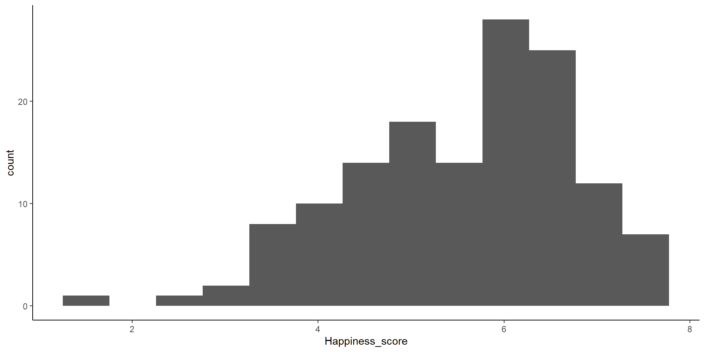

## Today's Packages and Data 🤗

:::: {.columns}
::: {.column width="50%"}


::: {.cell .code-150}

```{.r .cell-code  code-fold="true" code-summary="Install Packages Code" code-line-numbers="false"}
# run for packages that you have not installed yet
install.packages("tidyverse")
install.packages("rio")
install.packages("e1071")
```
:::

::: {.cell .code-150}

```{.r .cell-code  code-line-numbers="false"}
library(tidyverse)
library(rio)
library(e1071)
```
:::


</br>

<div style="font-size: 26px">

::: {.panel-tabset}
### `tidyverse`

The `tidyverse` package [@wickham2023] loads a suite of packages that help with data manipulation and visualization. You can find the full package list [here](https://www.tidyverse.org/packages){target="_blank"}. Among others, `tidyverse` loads both  `dplyr` and `ggplot2`. 

### `dplyr`

The `dplyr` package [@wickham2023a] offers a set of intuitive functions to work with data. The `dplyr` functions are great for data manipulation and data cleaning.

### `ggplot2`

The `ggplot2` package [@wickham2024] is the most popular R package for data visualization. There exist other ways to create data visualizations in R, but `ggplot2` is usually my choice.

### `rio`

The `rio` package [@becker2024] developers describe this package as the *Swiss-Army Knife for Data I/O*. The `import()` and `export()` functions can import/export just about any data type.

### `e1071`

The `e1071` [@meyer2024] package contains a bunch of machine learning functions. We will only use it to calculate skewness and kurtosis. 


:::

</div>

:::
::: {.column width="50%"}

<center style="padding-bottom: 21px;"> [Data]{.data-title} </center>

You can open the data without any downloads with the line below. see [Here](https://fabio-setti.netlify.app/psyc7804/slides%20files/lab%201#/how-i-will-fix-everyones-working-directory-issues){target="_blank"} for *why* and *how* I do it. 
 


::: {.cell .code-125}

```{.r .cell-code  code-line-numbers="false"}
WH_2024 <- import("https://fabio-setti.netlify.app/data/World_happiness_2024.csv")
```
:::


<div style="font-size: 22px"> We'll use the [2024 world happiness report](https://www.worldhappiness.report/ed/2024){target="_blank"} data again. </div>


::: {.cell}
::: {.cell-output-display}

```{=html}
<div id="htmlwidget-274b7d1f8e3f31f8f770" class="reactable html-widget" style="width:auto;height:300px;"></div>
<script type="application/json" data-for="htmlwidget-274b7d1f8e3f31f8f770">{"x":{"tag":{"name":"Reactable","attribs":{"data":{"Country_name":["Finland","Denmark","Iceland","Sweden","Israel","Netherlands","Norway","Luxembourg","Switzerland","Australia","New Zealand","Costa Rica","Kuwait","Austria","Canada","Belgium","Ireland","Czechia","Lithuania","United Kingdom","Slovenia","United Arab Emirates","United States","Germany","Mexico","Uruguay","France","Saudi Arabia","Kosovo","Singapore","Taiwan Province of China","Romania","El Salvador","Estonia","Poland","Spain","Serbia","Chile","Panama","Malta","Italy","Guatemala","Nicaragua","Brazil","Slovakia","Latvia","Uzbekistan","Argentina","Kazakhstan","Cyprus","Japan","South Korea","Philippines","Vietnam","Portugal","Hungary","Paraguay","Thailand","Malaysia","China","Honduras","Croatia","Greece","Bosnia and Herzegovina","Libya","Jamaica","Peru","Dominican Republic","Mauritius","Moldova","Russia","Bolivia","Ecuador","Kyrgyzstan","Montenegro","Mongolia","Colombia","Venezuela","Indonesia","Bulgaria","Armenia","South Africa","North Macedonia","Algeria","Hong Kong S.A.R. of China","Albania","Congo (Brazzaville)","Mozambique","Georgia","Iraq","Nepal","Laos","Gabon","Ivory Coast","Guinea","Turkiye","Senegal","Iran","Azerbaijan","Nigeria","Cameroon","Ukraine","Namibia","Morocco","Pakistan","Niger","Burkina Faso","Mauritania","Gambia","Chad","Kenya","Tunisia","Benin","Uganda","Myanmar","Cambodia","Ghana","Liberia","Mali","Madagascar","Togo","Jordan","India","Egypt","Sri Lanka","Bangladesh","Ethiopia","Tanzania","Comoros","Yemen","Zambia","Eswatini","Malawi","Botswana","Zimbabwe","Congo (Kinshasa)","Sierra Leone","Lesotho","Lebanon","Afghanistan"],"Region":["Western Europe","Western Europe","Western Europe","Western Europe","Middele East","Western Europe","Western Europe","Western Europe","Western Europe","Oceania","Oceania","South America","Middele East","Western Europe","North America","Western Europe","Western Europe","Eastern Europe","Eastern Europe","Western Europe","Eastern Europe","Middele East","North America","Western Europe","North America","South America","Western Europe","Middele East","Eastern Europe","Asia","Asia","Eastern Europe","North America","Eastern Europe","Eastern Europe","Western Europe","Eastern Europe","South America","North America","Western Europe","Western Europe","North America","North America","South America","Eastern Europe","Eastern Europe","Asia","South America","Asia","Western Europe","Asia","Asia","Asia","Asia","Western Europe","Eastern Europe","South America","Asia","Asia","Asia","North America","Eastern Europe","Western Europe","Eastern Europe","Africa","Caribbean","South America","Caribbean","Africa","Eastern Europe","Eastern Europe","South America","South America","Asia","Eastern Europe","Asia","South America","South America","Asia","Eastern Europe","Eastern Europe","Africa","Eastern Europe","Africa","Asia","Eastern Europe","Africa","Africa","Eastern Europe","Middele East","Asia","Asia","Africa","Africa","Africa","Western Europe","Africa","Middele East","Eastern Europe","Africa","Africa","Eastern Europe","Africa","Africa","Middele East","Africa","Africa","Africa","Africa","Africa","Africa","Africa","Africa","Africa","Asia","Asia","Africa","Africa","Africa","Africa","Africa","Middele East","Asia","Africa","Asia","Asia","Africa","Africa","Africa","Middele East","Africa","Africa","Africa","Africa","Africa","Africa","Africa","Africa","Middele East","Middele East"],"Happiness_score":[7.741,7.583,7.525,7.344,7.341,7.319,7.302,7.122,7.06,7.057,7.029,6.955,6.951,6.905,6.9,6.894,6.838,6.822,6.818,6.749,6.743,6.733,6.725,6.719,6.678,6.611,6.609,6.594,6.561,6.523,6.503,6.491,6.469,6.448,6.442,6.421,6.411,6.36,6.358,6.346,6.324,6.287,6.284,6.272,6.257,6.234,6.195,6.188,6.188,6.068,6.06,6.058,6.048,6.043,6.03,6.017,5.977,5.976,5.975,5.973,5.968,5.942,5.934,5.877,5.866,5.842,5.841,5.823,5.816,5.816,5.785,5.784,5.725,5.714,5.707,5.696,5.695,5.607,5.568,5.463,5.455,5.422,5.369,5.364,5.316,5.304,5.221,5.216,5.185,5.166,5.158,5.139,5.106,5.08,5.023,4.975,4.969,4.923,4.893,4.881,4.874,4.873,4.832,4.795,4.657,4.556,4.548,4.505,4.485,4.471,4.47,4.422,4.377,4.372,4.354,4.341,4.289,4.269,4.232,4.228,4.214,4.186,4.054,3.977,3.898,3.886,3.861,3.781,3.566,3.561,3.502,3.502,3.421,3.383,3.341,3.295,3.245,3.186,2.707,1.721],"Log_GDP":[1.844,1.908,1.881,1.878,1.803,1.901,1.952,2.141,1.97,1.854,1.81,1.561,1.845,1.885,1.84,1.868,2.129,1.783,1.766,1.822,1.786,1.983,1.939,1.871,1.521,1.596,1.818,1.842,1.364,2.118,1.842,1.699,1.265,1.752,1.738,1.766,1.538,1.616,1.702,1.827,1.8,1.26,1.097,1.43,1.706,1.7,1.212,1.562,1.622,1.794,1.786,1.815,1.232,1.331,1.728,1.722,1.398,1.484,1.646,1.497,1.091,1.71,1.684,1.465,1.526,1.28,1.371,1.517,1.57,1.385,1.642,1.217,1.315,1.054,1.571,1.353,1.437,0,1.361,1.629,1.444,1.389,1.475,1.324,1.909,1.438,0.892,0.56,1.467,1.249,0.965,1.208,1.403,1.08,0.831,1.702,0.927,1.435,1.433,1.042,0.943,1.35,1.266,1.213,1.069,0.573,0.756,1.078,0.75,0.603,1.037,1.306,0.914,0.772,0.978,1.011,1.077,0.619,0.747,0.628,0.758,1.262,1.166,1.37,1.361,1.122,0.792,0.82,0.896,0.671,0.899,1.255,0.617,1.445,0.748,0.534,0.654,0.771,1.377,0.628],"Social_support":[1.572,1.52,1.617,1.501,1.513,1.462,1.517,1.355,1.425,1.461,1.527,1.373,1.364,1.336,1.459,1.44,1.39,1.511,1.454,1.326,1.502,1.164,1.392,1.39,1.241,1.431,1.348,1.361,1.277,1.361,1.346,1.236,1.08,1.527,1.417,1.471,1.391,1.369,1.392,1.444,1.328,1.169,1.263,1.269,1.54,1.508,1.394,1.381,1.457,1.217,1.354,1.178,1.146,1.267,1.368,1.528,1.408,1.347,1.143,1.239,1.035,1.445,1.276,1.318,1.1,1.324,1.18,1.272,1.358,1.277,1.351,1.179,1.151,1.477,1.318,1.511,1.241,1.321,1.184,1.469,1.154,1.369,1.277,1.191,1.184,0.924,0.622,0.883,0.99,0.996,0.99,0.846,1.038,0.578,0.622,1.175,0.751,1.136,0.876,1.075,0.856,1.315,1.212,0.471,0.6,0.677,0.685,0.705,0.684,0.805,0.895,0.955,0.128,1.151,0.988,1.019,0.747,0.673,0.688,0.823,0.586,0.983,0.653,0.996,1.179,0.249,0.915,0.706,0.328,1.281,0.809,0.925,0.41,0.969,0.85,0.665,0.566,0.851,0.577,0],"Healthy_life_expectancy":[0.695,0.699,0.718,0.724,0.74,0.706,0.704,0.708,0.747,0.692,0.673,0.661,0.661,0.696,0.701,0.69,0.7,0.638,0.598,0.672,0.695,0.563,0.542,0.702,0.544,0.592,0.727,0.511,0.599,0.769,0.65,0.583,0.549,0.657,0.639,0.729,0.585,0.673,0.633,0.707,0.72,0.467,0.542,0.548,0.638,0.564,0.539,0.585,0.556,0.744,0.785,0.77,0.441,0.539,0.699,0.596,0.549,0.62,0.54,0.629,0.502,0.637,0.696,0.587,0.55,0.567,0.662,0.511,0.49,0.542,0.531,0.488,0.64,0.588,0.587,0.4,0.648,0.491,0.472,0.567,0.603,0.322,0.569,0.568,0.857,0.638,0.306,0.156,0.524,0.498,0.443,0.423,0.344,0.288,0.236,0.631,0.392,0.571,0.496,0.256,0.288,0.513,0.307,0.495,0.321,0.293,0.274,0.4,0.33,0.199,0.353,0.579,0.284,0.373,0.436,0.442,0.36,0.301,0.267,0.333,0.32,0.594,0.417,0.488,0.586,0.513,0.42,0.38,0.37,0.293,0.264,0.176,0.349,0.241,0.232,0.262,0.253,0,0.556,0.242],"Freedom":[0.859,0.823,0.819,0.838,0.641,0.725,0.835,0.801,0.759,0.756,0.746,0.797,0.827,0.703,0.73,0.729,0.758,0.787,0.533,0.713,0.789,0.815,0.586,0.7,0.722,0.775,0.65,0.787,0.739,0.743,0.649,0.717,0.816,0.805,0.6,0.619,0.663,0.651,0.72,0.727,0.513,0.735,0.793,0.685,0.566,0.666,0.835,0.681,0.733,0.529,0.632,0.555,0.826,0.843,0.757,0.581,0.788,0.756,0.829,0.704,0.72,0.469,0.337,0.621,0.592,0.647,0.615,0.73,0.641,0.695,0.551,0.719,0.606,0.834,0.632,0.501,0.644,0.518,0.779,0.62,0.65,0.537,0.58,0.247,0.485,0.69,0.523,0.728,0.68,0.425,0.653,0.796,0.516,0.547,0.521,0.202,0.607,0.366,0.668,0.566,0.521,0.631,0.47,0.631,0.542,0.615,0.483,0.343,0.459,0.411,0.519,0.254,0.567,0.587,0.45,0.863,0.623,0.546,0.586,0.25,0.453,0.593,0.767,0.49,0.583,0.775,0.441,0.709,0.172,0.362,0.727,0.284,0.571,0.567,0.487,0.473,0.469,0.523,0.173,0],"Generosity":[0.142,0.204,0.258,0.221,0.153,0.247,0.224,0.146,0.173,0.225,0.226,0.109,0.2,0.214,0.23,0.17,0.205,0.177,0.044,0.267,0.157,0.209,0.223,0.174,0.086,0.106,0.112,0.114,0.254,0.168,0.068,0.041,0.083,0.166,0.081,0.119,0.2,0.117,0.063,0.25,0.112,0.105,0.133,0.13,0.096,0.127,0.251,0.087,0.149,0.124,0.023,0.126,0.099,0.094,0.047,0.123,0.131,0.283,0.226,0.132,0.175,0.064,0.018,0.246,0.111,0.089,0.078,0.086,0.123,0.077,0.138,0.1,0.087,0.225,0.11,0.237,0.072,0.192,0.399,0.083,0.051,0.078,0.194,0.091,0.147,0.138,0.124,0.158,0,0.141,0.209,0.17,0.045,0.12,0.21,0.068,0.152,0.235,0.112,0.201,0.126,0.285,0.069,0.042,0.144,0.145,0.173,0.133,0.324,0.218,0.282,0.024,0.112,0.178,0.401,0.17,0.183,0.178,0.12,0.172,0.127,0.059,0.174,0.025,0.144,0.14,0.27,0.191,0.128,0.08,0.168,0.059,0.135,0.014,0.096,0.189,0.181,0.082,0.068,0.091],"Corruption":[0.454,0.452,0.818,0.476,0.807,0.628,0.516,0.568,0.502,0.677,0.52,0.877,0.828,0.695,0.632,0.689,0.582,0.932,0.884,0.649,0.869,0.742,0.831,0.632,0.873,0.78,0.719,0.812,0.927,0.425,0.798,0.994,0.747,0.599,0.825,0.823,0.899,0.925,0.957,0.875,0.926,0.922,0.749,0.858,0.942,0.922,0.785,0.92,0.88,0.951,0.781,0.842,0.864,0.84,0.965,0.933,0.935,0.976,0.881,0.836,0.919,0.957,0.907,1,0.796,0.972,0.971,0.804,0.882,0.956,0.879,0.939,0.922,0.97,0.868,0.945,0.941,0.914,0.945,0.994,0.827,0.966,0.985,0.8,0.598,0.951,0.862,0.804,0.826,0.952,0.885,0.833,0.9,0.836,0.893,0.885,0.931,0.877,0.801,0.981,0.94,0.975,0.939,0.918,0.926,0.853,0.821,0.802,0.952,0.887,0.931,0.982,0.748,0.946,0.826,0.929,0.972,0.925,0.91,0.877,0.844,0.811,0.878,0.741,0.969,0.833,0.899,0.743,0.84,0.887,0.891,0.884,0.864,0.918,0.869,0.928,0.947,0.915,0.971,0.912]},"columns":[{"id":"Country_name","name":"Country_name","type":"character"},{"id":"Region","name":"Region","type":"character"},{"id":"Happiness_score","name":"Happiness_score","type":"numeric"},{"id":"Log_GDP","name":"Log_GDP","type":"numeric"},{"id":"Social_support","name":"Social_support","type":"numeric"},{"id":"Healthy_life_expectancy","name":"Healthy_life_expectancy","type":"numeric"},{"id":"Freedom","name":"Freedom","type":"numeric"},{"id":"Generosity","name":"Generosity","type":"numeric"},{"id":"Corruption","name":"Corruption","type":"numeric"}],"pagination":false,"highlight":true,"style":{"fontFamily":"Work Sans, sans-serif","fontSize":"1rem"},"height":"300px","dataKey":"79a189929a84d6ba059984611a1e094c"},"children":[]},"class":"reactR_markup"},"evals":[],"jsHooks":[]}</script>
```

:::
:::


:::
::::


## Ways Of Taking a Look at the data

Here are two similar ways of taking a general look at our data. 

:::: {.columns}
::: {.column width="50%"}


::: {.fragment fragment-index=1}

As shown in Lab 1, the base R function is `str()`


::: {.cell .code-125}

```{.r .cell-code  code-line-numbers="false"}
str(WH_2024)
```

::: {.cell-output .cell-output-stdout}

``` hscroll
'data.frame':	140 obs. of  9 variables:
 $ Country_name           : chr  "Finland" "Denmark" "Iceland" "Sweden" ...
 $ Region                 : chr  "Western Europe" "Western Europe" "Western Europe" "Western Europe" ...
 $ Happiness_score        : num  7.74 7.58 7.53 7.34 7.34 ...
 $ Log_GDP                : num  1.84 1.91 1.88 1.88 1.8 ...
 $ Social_support         : num  1.57 1.52 1.62 1.5 1.51 ...
 $ Healthy_life_expectancy: num  0.695 0.699 0.718 0.724 0.74 0.706 0.704 0.708 0.747 0.692 ...
 $ Freedom                : num  0.859 0.823 0.819 0.838 0.641 0.725 0.835 0.801 0.759 0.756 ...
 $ Generosity             : num  0.142 0.204 0.258 0.221 0.153 0.247 0.224 0.146 0.173 0.225 ...
 $ Corruption             : num  0.454 0.452 0.818 0.476 0.807 0.628 0.516 0.568 0.502 0.677 ...
```


:::

```{.r .cell-code  code-line-numbers="false"}
# NOTE: `num` and `<dbl>` are the same type of variable
```
:::


:::

:::
::: {.column width="50%"}


::: {.fragment fragment-index=2}

The `dplyr` function to look at data is `glimpse()`


::: {.cell .code-125}

```{.r .cell-code  code-line-numbers="false"}
glimpse(WH_2024)
```

::: {.cell-output .cell-output-stdout}

``` hscroll
Rows: 140
Columns: 9
$ Country_name            <chr> "Finland", "Denmark", "Iceland", "Sweden", "Is…
$ Region                  <chr> "Western Europe", "Western Europe", "Western E…
$ Happiness_score         <dbl> 7.741, 7.583, 7.525, 7.344, 7.341, 7.319, 7.30…
$ Log_GDP                 <dbl> 1.844, 1.908, 1.881, 1.878, 1.803, 1.901, 1.95…
$ Social_support          <dbl> 1.572, 1.520, 1.617, 1.501, 1.513, 1.462, 1.51…
$ Healthy_life_expectancy <dbl> 0.695, 0.699, 0.718, 0.724, 0.740, 0.706, 0.70…
$ Freedom                 <dbl> 0.859, 0.823, 0.819, 0.838, 0.641, 0.725, 0.83…
$ Generosity              <dbl> 0.142, 0.204, 0.258, 0.221, 0.153, 0.247, 0.22…
$ Corruption              <dbl> 0.454, 0.452, 0.818, 0.476, 0.807, 0.628, 0.51…
```


:::
:::


:::

:::
::::

::: {.fragment fragment-index=3}
Personally, I usually just use the bulit-in RStudio viewer to look at data. You can open it by clicking on the `WH_2024` object in the environment or by running `View(WH_2024)`.
:::

## Tables and Porportions

We have also seen the `table()` function in Lab 1. Here we count the number of countries in each `Region`:


::: {.cell .code-125}

```{.r .cell-code  code-line-numbers="false"}
table(WH_2024$Region)
```

::: {.cell-output .cell-output-stdout}

``` hscroll

        Africa           Asia      Caribbean Eastern Europe   Middele East 
            40             22              2             23             11 
 North America        Oceania  South America Western Europe 
             8              2             11             21 
```


:::
:::


:::: {.columns}
::: {.column width="50%"}


::: {.fragment fragment-index=1}

What if we want the proportion of countries in each region? We divide by the total number of countries.


::: {.cell .code-125}

```{.r .cell-code  code-line-numbers="false"}
# many ways to get the total. Here I just get the rows of the data since every row is an individual country
table(WH_2024$Region)/nrow(WH_2024)
```

::: {.cell-output .cell-output-stdout}

``` hscroll

        Africa           Asia      Caribbean Eastern Europe   Middele East 
    0.28571429     0.15714286     0.01428571     0.16428571     0.07857143 
 North America        Oceania  South America Western Europe 
    0.05714286     0.01428571     0.07857143     0.15000000 
```


:::
:::


:::
:::

::: {.column width="50%"}

::: {.fragment fragment-index=2}
Of course we can get percentages by multiplying the proportions by $100$


::: {.cell .code-125}

```{.r .cell-code  code-line-numbers="false"}
table(WH_2024$Region)/nrow(WH_2024)*100
```

::: {.cell-output .cell-output-stdout}

``` hscroll

        Africa           Asia      Caribbean Eastern Europe   Middele East 
     28.571429      15.714286       1.428571      16.428571       7.857143 
 North America        Oceania  South America Western Europe 
      5.714286       1.428571       7.857143      15.000000 
```


:::
:::


:::
:::
::::


## Central Tendency: Mode 

The **mode** is the value that occurs the most in a set of observations. In practice we would calculate the mode only for discrete or ordinal data (e.g., Likert scales).

:::: {.columns}
::: {.column width="50%"}

::: {.fragment fragment-index=1}
There is no function that directly calculates the mode, but finding the values that occurs the most in a vector is a very simple task. Here we use `which.max()`:


::: {.cell .code-125}

```{.r .cell-code  code-line-numbers="false"}
tab <- table(WH_2024$Region)
# we give the output of table(WH_2024$Region) as the input to which.max()
which.max(tab)
```

::: {.cell-output .cell-output-stdout}

```
Africa 
     1 
```


:::
:::


Given a vector of numbers, the `which.max()` function returns the *index* of the highest value. Thus *Africa* is the mode of the `Region` variable. 

:::

:::
::: {.column width="50%"}


::: {.fragment fragment-index=2}
Let's say that at the same time I would like to know how many times the mode occurs. Instead of just printing all the values of our table, much more efficient is:


::: {.cell .code-125}

```{.r .cell-code  code-line-numbers="false"}
tab[which.max(tab)]
```

::: {.cell-output .cell-output-stdout}

```
Africa 
    40 
```


:::
:::


Here we use the fact that `which.max()` always gives the index of th highest value (`1`, the first one, in this case). Then we extract that value from the `tab` object by using the the `[]` operator
:::

:::
::::

## Central Tendency: Mean and Median

The mean and median are measures of *central tendency*. We use them to describe values around which data tends to cluster.

:::: {.columns}
::: {.column width="55%"}


::: {.fragment fragment-index=1}
- **Mean:** $\bar{x} = \frac{\sum x_i}{n}$, where the numerator is the sum of all the observations and $n$ is the sample size.  
:::
::: {.fragment fragment-index=2}
- **Median:** The value at the 50<sup>th</sup> percentile (more about percentiles later)
:::

::: {.fragment fragment-index=3}
The mean is by far more popular than the median for [mathematical reasons](https://www.probabilitycourse.com/chapter3/3_2_2_expectation.php){target="_blank"}, but is influenced by *outliers*

In the case on the right, the median better describes the central tendency of the `x` vector.
:::

:::
::: {.column width="45%"}


::: {.fragment fragment-index=1}


::: {.cell .code-125}

```{.r .cell-code  code-line-numbers="false"}
mean(WH_2024$Happiness_score)
```

::: {.cell-output .cell-output-stdout}

```
[1] 5.530893
```


:::
:::


:::


::: {.fragment fragment-index=2}


::: {.cell .code-125}

```{.r .cell-code  code-line-numbers="false"}
median(WH_2024$Happiness_score)
```

::: {.cell-output .cell-output-stdout}

```
[1] 5.8005
```


:::
:::


:::

::: {.fragment fragment-index=3}


::: {.cell .code-125}

```{.r .cell-code  code-line-numbers="false"}
# some values with an outlier
x <- c(3,4,5,6,7,8,3,4,5,6,7,90)
mean(x)
```

::: {.cell-output .cell-output-stdout}

```
[1] 12.33333
```


:::

```{.r .cell-code  code-line-numbers="false"}
median(x)
```

::: {.cell-output .cell-output-stdout}

```
[1] 5.5
```


:::
:::


:::

:::
::::

::: {.fragment fragment-index=4}
Still, to describe continuous or ordinal variables, we generally use the mean. 
:::

## Dispersion: Variance and Standard Deviation

The variance and standard deviation (SD) are measures of how "spread out" the data is. Mathematically, they are both measures of how distant observations are from the mean on average. 

:::: {.columns}
::: {.column width="55%"}

::: {.fragment fragment-index=1}
- **Variance:** $S^2 = \frac{\sum (x_i - \bar{x})^2}{n - 1}$, where the numerator is the sum of all the squared differences between each observation ($x_i$) and the mean ($\bar{x}$). The denominator simply divides by the total number of observations ($n$) [minus 1](https://en.wikipedia.org/wiki/Bessel%27s_correction){target="_blank"}. 
:::

::: {.fragment fragment-index=2}
- **Standard deviation:** $S = \sqrt{\frac{\sum (x_i - \bar{x})^2}{n - 1}}$, which is simply the square root of the variance. 
:::
:::
::: {.column width="45%"}

::: {.fragment fragment-index=1}


::: {.cell .code-125}

```{.r .cell-code  code-line-numbers="false"}
var(WH_2024$Happiness_score)
```

::: {.cell-output .cell-output-stdout}

```
[1] 1.395344
```


:::
:::


:::

</br>
</br>
</br>

::: {.fragment fragment-index=2}


::: {.cell .code-125}

```{.r .cell-code  code-line-numbers="false"}
# same as `sqrt(var(WH_2024$Happiness_score))`
sd(WH_2024$Happiness_score)
```

::: {.cell-output .cell-output-stdout}

```
[1] 1.181247
```


:::
:::


:::

:::
::::

::: {.fragment fragment-index=3}
:::{.callout-note}
### Variance or Standard Deviation? 🤔

Glossing over a ton of mathematical nuances, the SD is the measure of dispersion that you should use. Why? The Variance *squares* your variable, making it into *squared units*, which are not very intuitive. By taking the square root of the variance, the SD turns it back into the *original units of the variable*, making it much easier to understand!
:::
:::

## Shape: Skewness and Kurtosis

Skewness and kurtosis are statistics that describe the *shape* of the distribution of some data.

:::: {.columns}
::: {.column width="60%"}

::: {.fragment fragment-index=1}
- **Skewness:** describes the *degree and direction of asymmetry* in a distribution. If it is negative, the distribution will have a left tail. If it is positive, the distribution will have a right tail. 
:::


::: {.fragment fragment-index=2}
- **Kurtosis:** describes the *peakedness* of a distribution. Negative values mean that the distribution is more flat than a normal distribution, while positive values imply that the distribution is more peaked than a normal distribution.
:::

:::
::: {.column width="40%"}

::: {.fragment fragment-index=1}


::: {.cell .code-125}

```{.r .cell-code  code-line-numbers="false"}
e1071::skewness(WH_2024$Happiness_score)
```

::: {.cell-output .cell-output-stdout}

```
[1] -0.5154923
```


:::
:::


:::

</br>
</br>

::: {.fragment fragment-index=2}


::: {.cell .code-125}

```{.r .cell-code  code-line-numbers="false"}
e1071::kurtosis(WH_2024$Happiness_score)
```

::: {.cell-output .cell-output-stdout}

```
[1] -0.2906174
```


:::
:::


:::
:::
::::

::: {.fragment fragment-index=3}
:::{.callout-note}
## The `::` Operator

The `::` operator is used to refer to a specific function from a package. So above, for example, I used the `kurtosis()` function from the `e1071` package. The difference between this and running `library(e1071)` followed by `kurtosis()` is that I am no loading the full `e1071` package. One of the advantage is that it makes it clear what package the `kurtosis()` function comes from; the other advantage is that it avoids [package conflicts](https://stats.oarc.ucla.edu/r/faq/how-does-r-handle-overlapping-object-names){target="_blank"}.
:::
:::

## Interactive Normal Distribution

:::: {.columns}
::: {.column width="80%"}
<iframe width="90%" height="600px" src="https://fabiosetti.shinyapps.io/Skew_Normal_distribution/"> </iframe>
:::
::: {.column width="20%"}

Notice how the mean, median, and mode are no longer the same after you add some skewness.

:::{.callout-note}
## Mode again?
I mentioned that we would not calculate the mode for continuous variables. Indeed, in the case of `Happiness_score`, no mode exists because all the values are different. However, when talking about a distribution (like the one on the left), the mode is defined as the *peak of the distribution*. 
:::


:::
::::


## Percentiles

Given a continuous variable, you can think of percentiles as cut-offs that divide observations into 100 ordered groups. Then, for example, we say that an observation above the 50<sup>th</sup> percentile is "above 50\% of the rest of the observations".

:::: {.columns}
::: {.column width="50%"}


::: {.fragment fragment-index=1}
We use the `quantile()` function to find the percentile of a variable:


::: {.cell .code-125}

```{.r .cell-code  code-line-numbers="false"}
# find the 50th percentile (the median). The first argument is the vector of observations and the second argument is the desired percentile (from 0 to 1)
quantile(WH_2024$Happiness_score, .5)
```

::: {.cell-output .cell-output-stdout}

```
   50% 
5.8005 
```


:::
:::


:::

::: {.fragment fragment-index=2}
We can also get multiple percentiles at once like so:


::: {.cell .code-125}

```{.r .cell-code  code-line-numbers="false"}
# get the 25th, 50th, and 75th percentiles of Happiness_score
quantile(WH_2024$Happiness_score, c(.25, .5, .75))
```

::: {.cell-output .cell-output-stdout}

```
    25%     50%     75% 
4.63175 5.80050 6.42625 
```


:::
:::


:::

:::
::: {.column width="50%"}

::: {.fragment fragment-index=3}
You may also want to use the interquartile range (IQR) to describe the range between which 50\% of the observations fall. 


::: {.cell .code-125}

```{.r .cell-code  code-line-numbers="false"}
IQR(WH_2024$Happiness_score)
```

::: {.cell-output .cell-output-stdout}

```
[1] 1.7945
```


:::
:::


:::

::: {.fragment fragment-index=4}

The IQR is just the 75<sup>th</sup> percentile minus the 25<sup>th</sup> percentile


::: {.cell .code-125}

```{.r .cell-code  code-line-numbers="false"}
# disregard the "75%" that appears above the number
quantile(WH_2024$Happiness_score, .75) - quantile(WH_2024$Happiness_score, .25)
```

::: {.cell-output .cell-output-stdout}

```
   75% 
1.7945 
```


:::
:::


:::
:::
::::

#


:::: {.columns}
::: {.column width="70%"}
</br>
</br>
</br>

<h1> Data Manipulation with `dplyr` </h1>
:::
::: {.column width="30%"}

<center>


</center>

:::
::::


## An Overview of `dplyr`

`dplyr` offers a host of function to manipulate data in R. You can more or less achieve anything `dplyr` does with base R functions, but it usually takes more work. Some `dplyr` functions that we will look at are:


::: {.fragment fragment-index=1}
:::: {.columns}
::: {.column width="50%"}

- `select()`: Selects a specific set of columns in a `data.frame`. It can also be used to discard specific columns.

- `mutate()`: Modifies or creates columns in a `data.frame`.
:::

::: {.column width="50%"}
- `filter()`: filters row of a `data.frame` based on one or more conditions.

- `gropu_by()` + `summarise()`: I almost always end up using these two functions together. `group_by()` groups the data and `summarise()` creates summaries for each group (makes more sense once you see it).

:::
::::
:::

::: {.fragment fragment-index=2}
Something neat about `tidyverse` functions such as the ones from `dplyr` is that they accept the *pipe operator*, `%>%`.

Later we will see that the advantage of the pipe operator is that it allows to perform multiple actions (e.g., filter the data, than select a column, then compute some summary statistics) in a single statement!
:::

## The `select()` Function

:::: {.columns}
::: {.column width="50%"}

We can select a subset of columns:


::: {.cell .code-125}

```{.r .cell-code  code-line-numbers="false"}
Select_EX1 <- WH_2024 %>% 
                select(Region, Happiness_score)

# check column names of Select_EX1 object
colnames(Select_EX1)
```

::: {.cell-output .cell-output-stdout}

```
[1] "Region"          "Happiness_score"
```


:::
:::


::: {.fragment fragment-index=1}
We can also remove columns:


::: {.cell .code-125}

```{.r .cell-code  code-line-numbers="false"}
Select_EX2 <- WH_2024 %>% 
                select(-Region, -Happiness_score)

colnames(Select_EX2)
```

::: {.cell-output .cell-output-stdout}

``` hscroll
[1] "Country_name"            "Log_GDP"                
[3] "Social_support"          "Healthy_life_expectancy"
[5] "Freedom"                 "Generosity"             
[7] "Corruption"             
```


:::
:::


:::
:::

::: {.column width="50%"}

::: {.fragment fragment-index=2}
Notice how the `%>%` *passes* the information to its left to the right. Oh, and you do not have to start a new line after `%>%`, it's just a convention for neater looking code 🤷


<p>The keyboard shortcut to get the `%>%` is <kbd>Ctrl</kbd> + <kbd>shift</kbd> + <kbd>M</kbd> (Windows) or <kbd>Cmd</kbd> + <kbd>shift</kbd> + <kbd>M</kbd> (Mac) </p>
:::

</br>


::: {.fragment fragment-index=3}
:::{.callout-note}
### `select()` not Working?

Sometimes your code will be perfectly fine but the `select()` function may give you problems.  There is a package called `MASS` that is often loaded in the background and also includes a function called `select()`, that does something completely different. Thus, you may be inadvertently be using the `select()` function from the `MASS` package 😱 this "issue" can be resolved by using the `::` operator and typing `dplyr::select(Region, Happiness_score)` in the first example on the left. Just keep this in mind if `select()` gives you trouble. 
:::
:::

:::
::::

## The `filter()` Function

:::: {.columns}
::: {.column width="50%"}


::: {.cell .code-125}

```{.r .cell-code  code-line-numbers="false"}
filter_EX1 <- WH_2024 %>% 
                filter(Region == "Africa")
# We are only left with rows where the Region variable has Africa
nrow(filter_EX1)
```

::: {.cell-output .cell-output-stdout}

```
[1] 40
```


:::
:::


::: {.fragment fragment-index=1}


::: {.cell .code-125}

```{.r .cell-code  code-line-numbers="false"}
filter_EX2 <- WH_2024 %>% 
                filter(Region == "Africa" & Happiness_score > 5)
# We filter for 2 condition by using the `&`. We additionally ask for only countries that have `Happiness_score` above 5
nrow(filter_EX2)
```

::: {.cell-output .cell-output-stdout}

```
[1] 9
```


:::
:::


:::

::: {.fragment fragment-index=2}


::: {.cell .code-125}

```{.r .cell-code  code-line-numbers="false"}
filter_EX3 <- WH_2024 %>% 
                filter(Region %in% c("Asia", "Africa"))
# the `%in%` operator is very useful. It selects all the rows where the Region variable has Africa OR Asia! `%in%` means "equal any of"
nrow(filter_EX3)
```

::: {.cell-output .cell-output-stdout}

```
[1] 62
```


:::
:::


:::

:::
::: {.column width="50%"}

::: {.fragment fragment-index=3}
As you can see on the left, there are many ways in which you can filter data. The catch is that it requires you knowing `conditional operators`:

<style>
td, th {
   border: none!important;
}
</style>

<div style="font-size: 24px">  
| Operator | Description                                   |
|----------|-----------------------------------------------|
|   `==`   | Equal to                                      |
|   `!=`   | Not equal to                                  |
|   `>`    | Greater than                                  |
|   `<`    | Less than                                     |
|   `>=`   | Greater than or equal to                      |
|   `<=`   | Less than or equal to                         |
|   `%in%` | Equal any of                                  |
|   `!`    | Logical NOT                                   |
|   `&`    | Element-wise logical AND                      |
|   `|`    | Element-wise logical OR                       |
</div>
:::

:::
::::


## The `mutate()` Function

:::: {.columns}
::: {.column width="50%"}


::: {.cell .code-125}

```{.r .cell-code  code-line-numbers="false"}
mutate_EX1 <- WH_2024 %>% 
               mutate(log_happiness = log(Happiness_score),
                      # here I sum two columns
                      free_gen = Freedom + Generosity)
str(mutate_EX1)
```

::: {.cell-output .cell-output-stdout}

``` hscroll
'data.frame':	140 obs. of  11 variables:
 $ Country_name           : chr  "Finland" "Denmark" "Iceland" "Sweden" ...
 $ Region                 : chr  "Western Europe" "Western Europe" "Western Europe" "Western Europe" ...
 $ Happiness_score        : num  7.74 7.58 7.53 7.34 7.34 ...
 $ Log_GDP                : num  1.84 1.91 1.88 1.88 1.8 ...
 $ Social_support         : num  1.57 1.52 1.62 1.5 1.51 ...
 $ Healthy_life_expectancy: num  0.695 0.699 0.718 0.724 0.74 0.706 0.704 0.708 0.747 0.692 ...
 $ Freedom                : num  0.859 0.823 0.819 0.838 0.641 0.725 0.835 0.801 0.759 0.756 ...
 $ Generosity             : num  0.142 0.204 0.258 0.221 0.153 0.247 0.224 0.146 0.173 0.225 ...
 $ Corruption             : num  0.454 0.452 0.818 0.476 0.807 0.628 0.516 0.568 0.502 0.677 ...
 $ log_happiness          : num  2.05 2.03 2.02 1.99 1.99 ...
 $ free_gen               : num  1.001 1.027 1.077 1.059 0.794 ...
```


:::
:::


:::
::: {.column width="50%"}

The `mutate()` function works by giving the name of the new variable on the left of the `=` sign and then the transformation of variables on the right. so, `new_var = some_transformation`. 


::: {.fragment fragment-index=1}

On the left I create 2 new variables:

- `log_happiness`, which is just a log transformation of the `Happiness_score` variable with the `log()` function.

- `free_gen`, which is the sum of the `Freedom` and `Generosity` variable.
:::

:::
::::


## The `group_by()` and `summarise()` Functions

As I mentioned, I generally use these functions together. Here is an example:

:::: {.columns}
::: {.column width="50%"}


::: {.cell .code-125}

```{.r .cell-code  code-line-numbers="false"}
WH_2024 %>% 
 group_by(Region) %>% 
  summarise(mean_happy = mean(Happiness_score),
            sd_happy = sd(Happiness_score))
```

::: {.cell-output .cell-output-stdout}

```
# A tibble: 9 × 3
  Region         mean_happy sd_happy
  <chr>               <dbl>    <dbl>
1 Africa               4.40   0.724 
2 Asia                 5.48   0.850 
3 Caribbean            5.83   0.0134
4 Eastern Europe       5.95   0.599 
5 Middele East         4.96   1.84  
6 North America        6.46   0.299 
7 Oceania              7.04   0.0198
8 South America        6.09   0.427 
9 Western Europe       6.75   0.664 
```


:::
:::


:::

::: {.column width="50%"}

In this case, the `summarise()` function creates a new object (a `tibble`, which is essentially a `data.frame`) that includes the mean (`mean()`) and SD (`sd()`) of `Happiness_score` *for each* `Region`. 

:::{.fragment fragment-index=1}

Just as before with the `mutate()` function, we need to name the resulting columns by specifying the names before the `=` sign.

:::

:::{.fragment fragment-index=2}
Note that this works because we first group the data by region using `group_by(Region)` and then pass it to `summarise()`. This would not be as easy without the `%>%` operator!
:::

:::
::::

## Concatenating `dplyr` Functions

The `%>%` shines when needing to perform multiple data manipulations in a row. Here is an example:


:::: {.columns}
::: {.column width="60%"}


::: {.cell .code-125}

```{.r .cell-code  code-line-numbers="false"}
# pass the data
WH_2024 %>%
  # select only two columns of interest
  select(Region, Freedom) %>%
    # filter for Asia and Eastern Europe countries only
    filter(Region %in% c("Asia", "Eastern Europe")) %>%
      # Group by Region
      group_by(Region) %>%
        # get the mean and median for the two regions
        summarise(Free_Mean = mean(Freedom),
                  Free_Median = median(Freedom))
```

::: {.cell-output .cell-output-stdout}

```
# A tibble: 2 × 3
  Region         Free_Mean Free_Median
  <chr>              <dbl>       <dbl>
1 Asia               0.709       0.750
2 Eastern Europe     0.649       0.65 
```


:::
:::


:::
::: {.column width="40%"}

This is just a random example of how you can be very flexible in how you manipulate data with `dplyr`! 

</br>

::: {.fragment fragment-index=1}
As always, there are multiple ways of achieving the same outcome in R. When dealing with `data.frame` objects, I personally like the `dplyr` functions to manipulate data. Others may prefer base R functions 🤷
:::

:::
::::


# 


:::: {.columns}
::: {.column width="70%"}
</br>
</br>
</br>

<h1> Data Visualization with `ggplot2` </h1>
:::
::: {.column width="30%"}

<center>


</center>

:::
::::


## Working With `ggplot2`

I use `ggplot2` a lot, but I can't say that I would be able to create any plot "off the top of my head". There are [many](https://ggplot2.tidyverse.org/reference/index.html){target="_blank"} `ggplot2` functions, so learning what all of them do is impossible. When using `ggplot2`, I recommend that you:  

:::: {.columns}
::: {.column width="50%"}

<ul style="font-size: 24px">

::: {.fragment fragment-index=1}
  <li> Try to understand *the logic* behind `ggplot2`'s syntax. </li>
:::

::: {.fragment fragment-index=2}
  <li> Start with a simple plot and progressively build upon it. </li>
:::  

::: {.fragment fragment-index=3}
  <li> Read functions documentation (i.e., function help menu) when something does not work as expected. </li>
:::

::: {.fragment fragment-index=4}
  <li> Look things up. Usually I start with some plot code that I find online that produces a similar plot to what I want, and then I modify/build on top of it. </li>
:::  
</ul>

::: {.fragment fragment-index=5}
::: {.callout-note}
## GGplot fact that you did not ask for
`ggplot2` is an implementation of [Leland Wilkinson](https://en.wikipedia.org/wiki/Leland_Wilkinson){target="_blank"}'s Grammar of Graphics, a scheme that breaks down data visualization into its components (e.g, lines, axes, layers...)
:::
:::

:::
::: {.column width="50%"}

<center>

{width="75%"}

</center>

:::
::::

## The Canvas

As mentioned in the box on the last slide, `ggplot2` breaks visualizations into small parts and pastes them on top of each other through the `+` operator.

:::: {.columns}
::: {.column width="30%"}


::: {.cell .code-125}

```{.r .cell-code  code-line-numbers="false"}
ggplot() 
```
:::


Just running `ggplot()` actually gives output! This is our "canvas"


(You cannot see anything because the output is a white square, but it's there, I promise 😅)

:::

::: {.column width="70%"}


::: {.cell}
::: {.cell-output-display}
{width=960}
:::
:::


:::
::::

## Define Coordinates with `aes()`

We use the `aes()` function to defined coordinates. Note that the name of the data object (`WH_2024` in our case) is almost always the first argument of the `ggplot()` function. Let's define the axes and put `Social_support` on the *x*-axis and `Happiness_score` on the *y*-axis. 

:::: {.columns}
::: {.column width="30%"}


::: {.cell .code-125}

```{.r .cell-code  code-line-numbers="false"}
ggplot(WH_2024,  
 aes(x = Social_support, 
     y = Happiness_score)) 
```
:::


:::
::: {.column width="70%"}


::: {.cell}
::: {.cell-output-display}
{width=960}
:::
:::


:::
::::

## Scatterplot

We use one of the `geom_...()` functions to add shapes to our plot. This is a the `geom_point()` function can be use to create scatterplots.

:::: {.columns}
::: {.column width="30%"}


::: {.cell .code-125}

```{.r .cell-code  code-line-numbers="false"}
ggplot(WH_2024,  
 aes(x = Social_support, 
     y = Happiness_score))  +
 geom_point()
```
:::


::: {.callout-note}
## `geom_...()`

The `geom_...()` functions add geometrical elements to a blank plot ([see here](https://ggplot2.tidyverse.org/reference/){target="_blank"} for a list of all the `geom_...()` functions). Note that most `geom_...()` will *inherit* the X and Y coordinates from the ones given to the `aes()` function in the `ggplot()` function. 
:::


:::
::: {.column width="70%"}


::: {.cell}
::: {.cell-output-display}
{width=960}
:::
:::


:::
::::

## Themes

Sometimes `ggplot2`'s default theme is not the best <span style="font-size: 22px"> (not sure what changed but it should look much worse than what I have on the slides) </span>. There are many [themes](https://r-charts.com/ggplot2/themes/){target="_blank"}
 you can choose from, I like `theme_classic()`.
 
:::: {.columns}
::: {.column width="30%"}


::: {.cell .code-125}

```{.r .cell-code  code-line-numbers="false"}
ggplot(WH_2024,  
 aes(x = Social_support, 
     y = Happiness_score))  +
 geom_point() +
 theme_classic()
```
:::


::: {.callout-note}

## Set plots theme globally

You can also use the `theme_set()` that will set a default theme for all the plots that you create afterwards. So, in our case, we could run `theme_set(theme_classic())`, and the `theme_classic()` function would be applied to all the following plots, without needing to specify `+ theme_classic()` every time.

:::
:::

::: {.column width="70%"}


::: {.cell}
::: {.cell-output-display}
{width=960}
:::
:::


:::
::::


##  Add Regression Line

We just drew a **linear regression line** through the data with `geom_smooth()`. The relation between `Social_support` and `Happiness_score` is strongly positive. 


:::: {.columns}
::: {.column width="30%"}


::: {.cell .code-125}

```{.r .cell-code  code-line-numbers="false"}
ggplot(WH_2024,  
 aes(x = Social_support, 
     y = Happiness_score))  +
 geom_point() +
 theme_classic() +
 geom_smooth(method = "lm", 
             se = FALSE)

# the argument `method = "lm"` tells `geom_smooth()` to draw a regression line. Other options exist 
```
:::


:::
::: {.column width="70%"}


::: {.cell}
::: {.cell-output-display}
{width=960}
:::
:::


:::
::::

## Modify Plot Elements


Here I made a bunch of changes to the plot. Spot the differences! What changes in the code resulted in what changes in the plot?

:::: {.columns}
::: {.column width="30%"}


::: {.cell}

```{.r .cell-code  code-line-numbers="false"}
ggplot(WH_2024,  
 aes(x = Social_support, 
     y = Happiness_score))  +
       geom_point(shape = 1) +
       theme_classic() +
       geom_smooth(method = "lm", 
                   color = "red") +
       labs(title = "Scatterplot Between Happiness and Social support By Country",
            y= "Country Happiness", 
            x = "Country Social Support") +
       theme(plot.title = element_text(hjust = 0.5, face = "bold", size = 16),
             axis.title.x  = element_text(face= "bold", size = 12),
             axis.title.y = element_text(face= "bold", size = 12))
```
:::


<br>

<div style="font-size: 24px">
**NOTE**: The `theme()` function takes in many arguments ([see here](https://ggplot2.tidyverse.org/reference/theme.html){target="_blank"}) that allow you to modify font size, position of plot elements, and much more! </div>


:::
::: {.column width="70%"}


::: {.cell}
::: {.cell-output-display}
{width=960}
:::
:::


 
:::
::::


## Histograms

Histograms are fairly useful for visualizing distributions of single variables. But you have to choose the number of `bins` appropriately.

:::: {.columns}
::: {.column width="30%"}


::: {.cell .code-125}

```{.r .cell-code  code-line-numbers="false"}
# set theme globally
theme_set(theme_classic())

ggplot(WH_2024,  
       # note that we only need to give X, why?
       aes(x = Happiness_score)) +
       geom_histogram()
```
:::


::: {.callout-note}
## bins? 
the number of **bins** is the number of bars on the plot. the `geom_histogram()` function defaults to 30 bins unless you specify otherwise (we indeed have 30 bars on the plot if you count them). 
:::
:::

::: {.column width="70%"}


::: {.cell}
::: {.cell-output-display}
{width=960}
:::
:::


:::
::::

There are a bit too many **bins**, so it is hard to get a good sense of the distribution. 


## Histograms bins

Now that we have reduced the number of bins, the distribution looks more reasonable (still not the best though). 

:::: {.columns}
::: {.column width="30%"}


::: {.cell .code-125}

```{.r .cell-code  code-line-numbers="false"}
ggplot(WH_2024,  
       aes(x = Happiness_score)) +
       geom_histogram(bins = 13) 
```
:::


:::


::: {.column width="70%"}


::: {.cell}
::: {.cell-output-display}
{width=960}
:::
:::


:::
::::

## Better Looking Histogram

Here I just touched up the plot a bit. Notice the `scale_y_continuous(expand = c(0,0))` function. Try running the plot without it and see if you notice the difference!

:::: {.columns}
::: {.column width="30%"}


::: {.cell .code-125}

```{.r .cell-code  code-line-numbers="false"}
ggplot(WH_2024,  
       aes(x = Happiness_score)) +
       geom_histogram(bins = 13, 
                      color = "black",
                      linewidth = .8,
                      fill = "#7a0b80") +
      scale_y_continuous(expand = c(0,0))
```
:::


::: {.callout-note}
## HEX color codes 

The "#7a0b80" is actually a color. R supports HEX color codes, which are codes that can represent just about all possible colors. There are many online color pickers ([see here](https://htmlcolorcodes.com/color-picker/){target="_blank"} for example) that will let you select a color and provide the corresponding HEX color code.  
:::

:::
::: {.column width="70%"}


::: {.cell}
::: {.cell-output-display}
{width=960}
:::
:::


:::
::::


## Boxplots

Box-plots very useful to get a sense of the variable's variance, range, and to check for presence of outliers. 


:::: {.columns}
::: {.column width="30%"}


::: {.cell .code-125}

```{.r .cell-code  code-line-numbers="false"}
ggplot(WH_2024,
       aes(y = Happiness_score)) +
       geom_boxplot()
```
:::


::: {.callout-note}

# Reading a Box-plot

The square represents the interquartile range, meaning that the bottom edge is the $25^{th}$ percentile of the variable and the top edge is the $75^{th}$ percentile of the variable. The bolded line is the median of the variable, which is not quite in the middle of the box. This suggests some degree of skew. 
:::

:::
::: {.column width="70%"}


::: {.cell}
::: {.cell-output-display}
{width=960}
:::
:::


:::
::::


## Grouped Boxplots 

Boxplots also work quite well to get a graphical representation of group differences. Let's plot `Happiness_score` by `Region`: 

:::: {.columns}
::: {.column width="30%"}


::: {.cell .code-125}

```{.r .cell-code  code-line-numbers="false"}
ggplot(WH_2024,
       aes(y = Happiness_score,
           x = Region)) +
       geom_boxplot()
```
:::


So, just by looking at this boxplot we can tell that there are some noticeble differences in the distribution of `Happiness_score` across `Region`
:::

::: {.column width="70%"}


::: {.cell}
::: {.cell-output-display}
{width=960}
:::
:::


:::
::::

## Kernel Density plots

Kernel density plots do a similar job to histograms, but I tend to prefer them over histograms. 

:::: {.columns}
::: {.column width="30%"}


::: {.cell .code-125}

```{.r .cell-code  code-line-numbers="false"}
ggplot(WH_2024,
       aes(x = Happiness_score)) +
       geom_density() +
       xlim(1, 10)
```
:::


<div style="font-size: 24px"> The `xlim()` function takes in 2 values that define the lower and upper bound of the *x*-axis (from 1 to 10). </div>


::: {.callout-note}
# Kernel? 

The word *kernel* takes on widely different meanings depending on the context. In this case it is a function that estimates the probability distribution of some data (the black line in the plot) by looking at the density of observations at every point on the $x$-axis. Kernel estimation is often referred to as a [non-parametric method](https://en.wikipedia.org/wiki/Nonparametric_statistics){target="_blank"}. 
:::

:::
::: {.column width="70%"}


::: {.cell}
::: {.cell-output-display}
{width=960}
:::
:::


:::
::::


## References 

<div id="refs"> </div>


