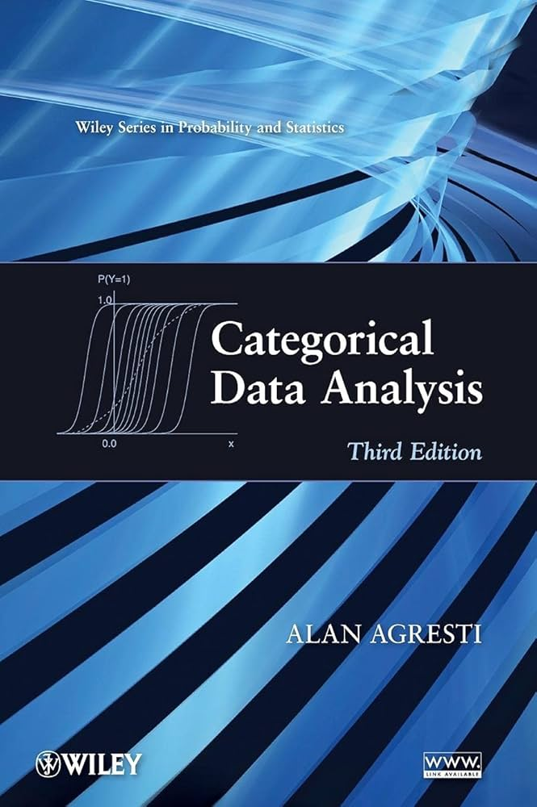

## Today's Packages and Data 🤗

:::: {.columns}
::: {.column width="50%"}


::: {.cell .code-125}

```{.r .cell-code  code-fold="true" code-summary="Install Packages Code" code-line-numbers="false"}
# run for packages that you have not installed yet
# install.packages("tidyverse")
install.packages("epitools")
```
:::


::: {.cell .code-125}

```{.r .cell-code  code-line-numbers="false"}
library(epitools)
library(tidyverse)
```
:::


::: {.panel-tabset}
### `epitools`

The `epitools` package [@aragon_etal_2020] includes many functions that help with calculating odds ratios and risk ratios. These are common statistics that are used to summarize the information in contingency tables.

:::
:::

::: {.column width="50%"}

<center style="padding-bottom: 21px;"> [Data]{.data-title} </center>

Today we'll look at some flight delays:
 

::: {.cell .code-125}

```{.r .cell-code  code-line-numbers="false"}
# rio::import() calls the import() function from the rio package without needing to load the package
flights <- rio::import("https://fabio-setti.netlify.app/data/Airlines.csv")
```
:::


::: {.cell .code-125}

```{.r .cell-code  code-line-numbers="false"}
# this dataset is quite big!
str(flights)
```

::: {.cell-output .cell-output-stdout}

``` hscroll
'data.frame':	539383 obs. of  9 variables:
 $ id         : int  1 2 3 4 5 6 7 8 9 10 ...
 $ Airline    : chr  "CO" "US" "AA" "AA" ...
 $ Flight     : int  269 1558 2400 2466 108 1094 1768 2722 2606 2538 ...
 $ AirportFrom: chr  "SFO" "PHX" "LAX" "SFO" ...
 $ AirportTo  : chr  "IAH" "CLT" "DFW" "DFW" ...
 $ DayOfWeek  : int  3 3 3 3 3 3 3 3 3 3 ...
 $ Time       : int  15 15 20 20 30 30 30 30 35 40 ...
 $ Length     : int  205 222 165 195 202 181 220 228 216 200 ...
 $ Delay      : int  1 1 1 1 0 1 0 0 1 1 ...
```


:::
:::


:::
::::

## Factor Variables

We will mostly be looking at categorical variables today, so it's a good point to introduce `factor` variables. Notice the `Delay` variable on the previous slide, which is an `integer` vector of *0*s and *1*s: 

:::: {.columns}
::: {.column width="50%"}


::: {.fragment fragment-index=1}

<div style="font-size: 26px"> Given a character or integer vector with some repeating values, we can turn the vector into a factor with the `factor()` function: </div>


::: {.cell .code-125}

```{.r .cell-code  code-line-numbers="false"}
# here I redefine the `Delay` column. You could also create a new column if you wanted to
flights$Delay <- factor(flights$Delay,
                        levels = c(0, 1),
                        labels = c("On Time", "Delay"))
```
:::


So, we define the values as 0 = *On Time* and 1 = *Delay*:


::: {.cell .code-125}

```{.r .cell-code  code-line-numbers="false"}
table(flights$Delay)
```

::: {.cell-output .cell-output-stdout}

```

On Time   Delay 
 299119  240264 
```


:::
:::


:::

:::
::: {.column width="50%"}

</br>

::: {.fragment fragment-index=2}

A `factor` variable is more or less the same as assigning value labels in SPSS.

<ul style="font-size: 26px">  

<li>  `levels =`: here you define the levels of you factors (the name of each group).  </li>
<li>  `labels =`: here you can label the corresponding groups. Now `0` and `1` will show up as `On Time` and `Delay`.  </li>

</ul> 

::: 

::: {.fragment fragment-index=3}
<div style="font-size: 24px"> We will see later that factor variables help when dealing with analyses involving categorical variables (mostly regressions and ANOVAs). </div>

:::

:::
::::

## &#x3C7;<sup>2</sup> Test of Goodness of Fit

The $\chi^2$ ($\chi$ reads "ki") test of goodness of fit refers to a test used to check whether some values occur at different rates than what you would expect. The simplest possible example is checking if a coin is fair (i.e., *heads* and *tails* come up 50% of the times):


:::: {.columns}
::: {.column width="50%"}

::: {.fragment fragment-index=1}
I flipped my coin 200 times and I got 110 heads and 90 tails:
:::


::: {.fragment fragment-index=3}

::: {.cell .code-125}

```{.r .cell-code  code-line-numbers="false"}
flips <- c(110, 90)

chisq.test(flips)
```

::: {.cell-output .cell-output-stdout}

```

	Chi-squared test for given probabilities

data:  flips
X-squared = 2, df = 1, p-value = 0.1573
```


:::
:::


:::

:::
::: {.column width="50%"}

::: {.fragment fragment-index=2}

The null and alternative hypotheses are:


<ul style="font-size: 26px">  

<li>  $H_0$: The coin is fair </li>

<li> $H_1$: The coin *is not* fair </li>

</ul>

:::


::: {.fragment fragment-index=3}
The `chisq.test()` function takes in either a vector or table of counts and runs a $\chi^2$ test.
:::

:::
::::

</br>


::: {.fragment fragment-index=4}
Thus, at $\alpha = .05$, there wasn't enough evidence to reject the $H_0$, $\chi^2(1) = 2$, $p = .16$. 
:::


## &#x3C7;<sup>2</sup> Test by Hand


::: {.fragment fragment-index=1}
Sometimes I like to run these analyses "by hand" to check that I am doing the right thing. In the lecture you have seen that the formula to calculate the $\chi^2$ statistic is given by:
:::


::: {.fragment fragment-index=2}
$$\chi^2 = \sum_i \frac{(O_i - E_i)^2}{E_i}$$


Where $O_i$ is the observed proportion of a category and $E_i$ is the expected proportion of that category. Since we have 200 flips, *if the coin is fair*, we expect both tails and heads to happen 100 times each ($E_i = 100$ in both cases), so:

:::

::: {.fragment fragment-index=3}

:::: {.columns}
::: {.column width="50%"}


::: {.cell .code-125}

```{.r .cell-code  code-line-numbers="false"}
# this is the formula above written in R (scary math can be done pretty quickly in R)
sum(((flips - 100)^2)/100)
```

::: {.cell-output .cell-output-stdout}

```
[1] 2
```


:::
:::


:::
::: {.column width="50%"}


::: {.cell .code-125}

```{.r .cell-code  code-line-numbers="false"}
# this gives the p-value (DFs in this case is always going to be the number of categories - 1)
pchisq(2, df = 1, lower.tail = FALSE)
```

::: {.cell-output .cell-output-stdout}

```
[1] 0.1572992
```


:::
:::

:::
::::

:::

::: {.fragment fragment-index=4}
Of course you would always use the `chisq.test()` function in practice, but I want to briefly touch on the intuition behind the $\chi^2$ formula. 
:::

## Intuition Behind the &#x3C7;<sup>2</sup> Statistic

Unfortunately many statistics formulas seem to come out of nowhere 🤷 $\chi^2 = \sum_i \frac{(O_i - E_i)^2}{E_i}$ is no exception. However, you can often gain a good sense of what the formula is doing by breaking down its components:

:::: {.columns}
::: {.column width="30%"}

::: {.fragment fragment-index=1}
- $\sum_i$: This sign says "sum all the *i* things". If you recall, this sign was also in the mean and the SD formula. In 99% of the cases, the $\sum$ sign is a tell that the formula is trying to summarize some information.
:::

:::
::: {.column width="40%"}


::: {.fragment fragment-index=2}
- $(O_i - E_i)^2$: The numerator is usually where the important stuff happens. Here, the numerator calculates *how different the observed count is from what we expected*. The $^2$ makes everything positive so that differences don't cancel out when you "sum all the *i* things" (the SD formula does the same!). 
:::

:::
::: {.column width="30%"}

::: {.fragment fragment-index=3}
- $E_i$: In most formulas the denominator makes sure the numerator is adjusted before been summed. In the case of the $\chi^2$, it adjusts for how often you expect to see each value. 
:::

:::

::::

::: {.fragment fragment-index=14}
So, the $\chi^2$ formula *summarizes how different your observed data is compared to what you would expect to see*. The more unexpected your observed frequencies, the larger the $\chi^2$ statistic will be. 
:::

## &#x3C7;<sup>2</sup> Test of Independence

<div style="font-size: 26px"> The $\chi^2$ test of independence is actually the same exact test as before; however, we call it test of *independence* when we use use it to analyze [contingency tables](https://en.wikipedia.org/wiki/Contingency_table){target="_blank"}. For example let's create a table with delays by two airplane companies, *Delta* and *American Airlines*:
 </div>

:::: {.columns}
::: {.column width="50%"}

::: {.fragment fragment-index=1}

 I create a new `data.frame` that only includes *Delta* and *AA*:
 

::: {.cell .code-125}

```{.r .cell-code  code-line-numbers="false"}
AA_vs_DL <- flights %>%
              filter(Airline %in% c("AA", "DL"))
```
:::


And then I create a table:


::: {.cell .code-125}

```{.r .cell-code  code-line-numbers="false"}
tabl <- table(AA_vs_DL$Airline, AA_vs_DL$Delay)
tabl
```

::: {.cell-output .cell-output-stdout}

```
    
     On Time Delay
  AA   27920 17736
  DL   33488 27452
```


:::
:::


:::

:::
::: {.column width="50%"}

::: {.fragment fragment-index=2}
The null and alternative hypotheses are:


<ul style="font-size: 26px">  

<li> $H_0$: Airlines and delays are independent </li>

<li> $H_1$: Airlines and delays *are not* independent </li>

</ul>


::: {.cell .code-125}

```{.r .cell-code  code-line-numbers="false"}
chisq.test(tabl)
```

::: {.cell-output .cell-output-stdout}

```

	Pearson's Chi-squared test with Yates' continuity correction

data:  tabl
X-squared = 410.66, df = 1, p-value < 2.2e-16
```


:::
:::


:::
:::
::::


::: {.fragment fragment-index=3}
We reject $H_0$, $\chi^2 (1) =  410.66$, $p < .001$, meaning that there is some association between airline and delay. 
:::

## Easily Find Expected Frequencies

Even in the case of a table the formula to calculate the $\chi^2$ statistic is still $\sum_i \frac{(O_i - E_i)^2}{E_i}$. Although it does not change the overall logic, the *expected* cell frequencies, $E_i$, is calculated in a slightly different way: $E_i =\frac{R_{tot} \times C_{\mathrm{tot}}}{Total}$, where

:::: {.columns}
::: {.column width="33%"}
- $R_{tot}$: total number of observations in *row*.
:::
::: {.column width="33%"}
- $C_{tot}$: total number of observations in *column*.
:::
::: {.column width="33%"}
- $Total$: Is the sum of all values in the table (the sample size).
:::
::::

:::: {.columns}
::: {.column width="40%"}

::: {.fragment fragment-index=1}

We'll need expected frequencies later. We can extract them like so:


::: {.cell .code-125}

```{.r .cell-code  code-line-numbers="false"}
chi_test <- chisq.test(tabl)
chi_test$expected
```

::: {.cell-output .cell-output-stdout}

```
    
      On Time    Delay
  AA 26301.58 19354.42
  DL 35106.42 25833.58
```


:::
:::


:::

:::
::: {.column width="60%"}


::: {.fragment fragment-index=2}

This works because the `chisq.test()` function actually saves a lot of information when you save it as an object.


::: {.cell .code-125}

```{.r .cell-code  code-line-numbers="false"}
names(chi_test)
```

::: {.cell-output .cell-output-stdout}

``` hscroll
[1] "statistic" "parameter" "p.value"   "method"    "data.name" "observed" 
[7] "expected"  "residuals" "stdres"   
```


:::
:::


The same is true for many of the functions that we will see later in the course. 

:::

:::
::::


## "Some Association"? What does that Mean?

You may find the *some association* part from two slides ago a bit vague...and you'd be right! All the $\chi^2$ test we just ran tells us is that there is *some association somewhere* in out table. In our case it is easy to figure out which airline has a higher proportion of delays, but it becomes much harder when the number of rows and columns increases 🧐 

::: {.fragment fragment-index=1}
Once again the $\chi^2$ formula summarize how different $O_i$s are from $E_i$s, how different the data is from what we would expect if $H_0$ is true. The idea is that, based on [probability theory](https://en.wikipedia.org/wiki/Independence_(probability_theory)){target="_blank"}:
::: 


::: {.fragment fragment-index=2}
<div style="height:30px;"></div>

<center>

<u> the only way that we observe something that is on average far from our expected frequencies is if there is some association between the rows and the columns </u> 

</center>

<div style="height:30px;"></div>

:::

::: {.fragment fragment-index=3}
Thus, it would be *really unlikely* to see a table of observed frequencies that is different that the expected if $H_0$ is true and there is no association. Notice that this is $H_1$ from two slides ago and is the only thing that you are testing when running a  $\chi^2$ test 🤔

:::


## Effect Sizes For &#x3C7;<sup>2</sup> Tests

<div style="font-size: 26px"> Ok, so, we know that there is some association between airlines and delays ($\chi^2 (1) =  410.66$, $p < .001$), but we really do not know how *practically meaningful* the strength of the association is (many statistically significant results are often practically meaningless 🫠). This is where [effect sizes](https://www.scribbr.com/statistics/effect-size){target="_blank"} come into the picture. Effect sizes are meant to be measures of *practical significance*, and they often have little relation with *statistical significance*. </div>


::: {.fragment fragment-index=1}

<div style="height:30px;"></div>

<center>  <p style='font-size: 28px'> Here are two popular effect sizes for $\chi^2$ tests </p>  </center>

<div style="height:40px;"></div>

:::

:::: {.columns}
::: {.column width="50%"}

::: {.fragment fragment-index=2}

<center> **$W$ Coefficient** </center>

$W = \sqrt{\frac{\chi^2}{Total}}$


::: {.cell .code-125}

```{.r .cell-code  code-line-numbers="false"}
# sum(tabl) sums all the values in the table, thus giving the total
sqrt(410.66/sum(tabl))
```

::: {.cell-output .cell-output-stdout}

```
[1] 0.06206843
```


:::
:::


:::
:::

::: {.column width="50%"}

::: {.fragment fragment-index=3}

<center> **Cramer's $V$** </center>

$V = \sqrt{\frac{\chi^2}{Total \times (k - 1)}}$, where $k$ is either the row or column with the smallest number of categories. 


::: {.cell .code-125}

```{.r .cell-code  code-line-numbers="false"}
# When both columns and rows have 2 categories, W and V are equivalent
sqrt(410.66/(sum(tabl)*(2 - 1)))
```

::: {.cell-output .cell-output-stdout}

```
[1] 0.06206843
```


:::
:::


:::

:::
::::

## Interpreting Effect Sizes

We got a $W = .06$. How big (or small) is that effect size? The correct answer is that it depends. The determination usually involves some cost-benefit trade off which depends on the field that you are in.

::: {.fragment fragment-index=1}
Everyone will reference effect sizes "guidelines" from @cohen_1988, who went through many popular effect sizes metrics and suggested some thresholds for what is a *small*, *medium*, and *large* effect size. 
:::


:::: {.columns}
::: {.column width="50%"}


::: {.fragment fragment-index=2}

According to Cohen's guidelines for $W$ :

<ul style="font-size: 28px">  

<li> $W = .1$ &rarr; small </li>

<li> $W = .3$ &rarr; medium </li>

<li> $W = .5$ &rarr; large </li>

</ul>

So, our effect size of $W = .06$ is **small**, meaning that the *degree* of association between airlines and delay is small (i.e., although one airline has more delays, it's not by that much).

:::

:::
::: {.column width="50%"}

::: {.fragment fragment-index=3}

:::{.callout-note}

### "Guidelines"? The Unfortunate Truth

The main argument for providing guidelines is that it helps applied researchers to make decisions. The idea is reasonable, but in my experience this sometimes turns into *"I don't really understand it, so tell me what to do based on these numbers in my output"*. The most obvious case is $p < .05$, which is probably the main cause of the [replication crisis](https://www.americanscientist.org/article/the-statistical-crisis-in-science){target="_blank"}. Unfortunately, we teach to follow these "guidelines", and this course will be no different (I am not happy about it 😔). When doing statistics in the real world, always stop and ask yourself <u>*why*</u> you are doing something or making a certain decision. If your answer is "because someone else said so", then you still do not know the <u>*why*</u>, which is the most important thing.
 
:::
:::
:::
::::

## Likelihood Ratio Test

You may come across the *likelihood ratio test*, which in the case of a contingency table ends up being quite similar to the $\chi^2$ test:

$$\chi^2 = 2 \sum_i[O_i \times \ln(\frac{O_i}{E_i}) ]$$

Where $\ln()$ is the [natural logarithm](https://www.youtube.com/watch?v=daUlTsnCNRQ){target="_blank"}. In R this scary equation is quite simple to compute:

:::: {.columns}
::: {.column width="50%"}

::: {.fragment fragment-index=1}


::: {.cell .code-125}

```{.r .cell-code  code-line-numbers="false"}
# NOTE: It may be worth spending some time understanding why this line of code works 
like_chi <- 2*sum(tabl*log(tabl/chi_test$expected))
```
:::


::: {.cell .code-125}
::: {.cell-output .cell-output-stdout}

```
[1] 411.9941
```


:::
:::


:::
:::

::: {.column width="50%"}


::: {.fragment fragment-index=1}

We get a really similar $\chi^2$ value and therefore a really similar *p*-value:


::: {.cell .code-125}

```{.r .cell-code  code-line-numbers="false"}
# DF are (Nrows - 1)*(Ncols - 1) = (2 - 1)*(2 - 1) = 1
pchisq(like_chi, df = 1, lower.tail = FALSE) 
```

::: {.cell-output .cell-output-stdout}

```
[1] 1.349157e-91
```


:::
:::


:::
:::
::::


::: {.fragment fragment-index=2}
The classical $\chi^2$ test generally works best for contingency tables. However, the likelihood ratio test is more general and will come up again because it can be used to compare different statistical models.
:::

## Small Expected Frequencies

Some smart math people have worked out that if any of the expected frequencies are too small ($E_i \leq 5$, not the case of the example), the the type I error rate (more on this in Lab 4) of the $\chi^2$ test is not accurate. In this case you should apply some *adjustments* to your $\chi^2$ statistic. Both of these are fine:

:::: {.columns}
::: {.column width="50%"}

::: {.fragment fragment-index=1}

<center> **Yates Correction** </center>

The `chisq.test()` function applies this correction by default. You can see it in the output:


::: {.cell .code-125}

```{.r .cell-code  code-line-numbers="false"}
chisq.test(tabl)
```

::: {.cell-output .cell-output-stdout}

``` hscroll

	Pearson's Chi-squared test with Yates' continuity correction

data:  tabl
X-squared = 410.66, df = 1, p-value < 2.2e-16
```


:::
:::


This is good because there is no "disadvantage" to applying this correction, so it may as well be the default.

:::

:::
::: {.column width="50%"}

::: {.fragment fragment-index=2}

<center> **E. Pearson Adjustment** </center>

$\chi^2_{adj} = \chi^2 \times \frac{N}{N -1}$, where $N$ is the sample size. 


::: {.cell .code-125}

```{.r .cell-code  code-line-numbers="false"}
# get unadjusted chi-square (it will be very similar to the adjusted one because our expected proportions are really large)
chi_unadj <- chisq.test(tabl, correct = FALSE)$statistic
```
:::


::: {.cell}
::: {.cell-output .cell-output-stdout}

```
X-squared 
 410.9175 
```


:::
:::


::: {.cell .code-125}

```{.r .cell-code  code-line-numbers="false"}
chi_unadj*(sum(tabl)/(sum(tabl) - 1))
```

::: {.cell-output .cell-output-stdout}

```
X-squared 
 410.9214 
```


:::
:::


The adjustment makes almost no difference because of the really large $N$. 

:::

:::
::::

## Fisher's Exact Test

When you have small expected frequencies, **Fisher's exact test** is probably a better choice than a $\chi^2$ test. The *why* it is a better choice is not straightforward to explain (but let me know if you are curious). 

:::: {.columns}
::: {.column width="50%"}

::: {.fragment fragment-index=1}
Fisher's exact test works by checking whether the **odds ratio** (see next slides) of the table is significantly different from 1. 
:::

::: {.fragment fragment-index=2}

::: {.cell .code-125}

```{.r .cell-code  code-line-numbers="false"}
fisher.test(tabl)
```

::: {.cell-output .cell-output-stdout}

```

	Fisher's Exact Test for Count Data

data:  tabl
p-value < 2.2e-16
alternative hypothesis: true odds ratio is not equal to 1
95 percent confidence interval:
 1.258956 1.322845
sample estimates:
odds ratio 
  1.290446 
```


:::
:::


:::
:::

::: {.column width="50%"}

::: {.fragment fragment-index=1}
The null and alternative hypotheses are:

<ul style="font-size: 26px">  

<li> $H_0$: the odds ratio is 1 </li>

<li> $H_1$: the odds ratio *is not* 1 </li>

</ul>

:::

::: {.fragment fragment-index=2}
The odds ratio is significantly different from 1, odds = 1.29, $p < .001$, 95\% CI[1.26, 1.32]
:::

::: {.fragment fragment-index=3}

:::{.callout-note}
### Fun Fact

Fisher's exact test is based on the [hypergeometric distribution](https://www.britannica.com/topic/hypergeometric-distribution){target="_blank"}. The fun fact is that the hypergeometric distribution is the probability distribution that is used to determine the probability of drawing certain hands in card games. Incidentally, the hypergeometric distribution is used a lot in [Texas Hold'em Poker](https://dlsun.github.io/probability/hypergeometric.html){target="_blank"}, and any other competitive card game really.
 
:::

:::

:::

::::


## Odds and Probability

Odds and probabilities are two different ways of describing the likelihood of an event occurring. Let's say that team A and team B are playing a Basketball game and we think know that team A wind 80\% of the times. Let's define $\pi = .8$ as the probability of team A winning. Then, the the **odds** of team A winning are:


::: {.fragment fragment-index=1}
$$\mathrm{odds} = \frac{\pi}{1 - \pi} = \frac{.8}{1 - .8} = 4 $$ 
:::
::: {.fragment fragment-index=2}
This is what you would normally hear as "team A has 4 to 1 odds of beating team B". It is important to note that given any odds, we can recover the **probability** $\pi$:
:::

::: {.fragment fragment-index=3}
$$\pi = \frac{\mathrm{odds}}{\mathrm{odds} + 1} = \frac{4}{4 + 1} = .8$$
:::

::: {.fragment fragment-index=4}

:::: {.columns}
::: {.column width="50%"}

**Odds:** Number of successes compared to number of failures.

:::
::: {.column width="50%"}

**Probability:** Number of successes compared to total number of trials. 

:::
::::
:::

## Odds Ratios

In the case of our airplane example, we can look at the odds of both Delta and AA having a delayed flight:

:::: {.columns}
::: {.column width="50%"}

<center>


::: {.cell .code-150}
::: {.cell-output .cell-output-stdout}

```
    
     On Time Delay
  AA   27920 17736
  DL   33488 27452
```


:::
:::

</center>

::: {.fragment fragment-index=1}

The "success" in this case is the flight being delayed, so it goes on top in the numerator.


::: {.cell .code-125}

```{.r .cell-code  code-line-numbers="false"}
# odds for AA 
tabl[1,2]/tabl[1,1]
```

::: {.cell-output .cell-output-stdout}

```
[1] 0.6352436
```


:::
:::


::: {.cell .code-125}

```{.r .cell-code  code-line-numbers="false"}
# odds for Delta
tabl[2,2]/tabl[2,1]
```

::: {.cell-output .cell-output-stdout}

```
[1] 0.8197563
```


:::
:::

**Note:** if you wanted the odds of flights being on time, you would flip the fractions above.
:::

:::

::: {.column width="50%"}

::: {.fragment fragment-index=2}
We see that Delta is more likely to have delays as it's odds are higher than AA. But by how much? We can calculate an **odds ratio**:

$$\mathrm{odds_{ratio}} = \frac{\mathrm{odds_{DL}}}{\mathrm{odds_{AA}}} = \frac{.82}{.63} = 1.3$$

:::
::: {.fragment fragment-index=3}
**Interpretation:** The odds of Delta flights being delayed are 1.3 larger than the odds of AA flights being delayed.

  <div style="height:30px;"></div>

So, an odds ratio is quite literally the ratio of two odds 😀 

:::
:::
::::

## Relative Risk

In epidemiology language, **Risk** is the exact same as probability. We can get the risk (probability) of either company's flights being delayed:

:::: {.columns}
::: {.column width="50%"}

<center>


::: {.cell .code-150}
::: {.cell-output .cell-output-stdout}

```
    
     On Time Delay
  AA   27920 17736
  DL   33488 27452
```


:::
:::

</center>

::: {.fragment fragment-index=1}
Because risk is probability, now we use the sum of the row in the denominator. Delays are still treated as "successes":


::: {.cell .code-125}

```{.r .cell-code  code-line-numbers="false"}
# risk for AA 
tabl[1,2]/sum(tabl[1,])
```

::: {.cell-output .cell-output-stdout}

```
[1] 0.3884703
```


:::
:::


::: {.cell .code-125}

```{.r .cell-code  code-line-numbers="false"}
# risk for Delta
tabl[2,2]/sum(tabl[2,])
```

::: {.cell-output .cell-output-stdout}

```
[1] 0.4504759
```


:::
:::

:::
:::

::: {.column width="50%"}


::: {.fragment fragment-index=2}
How much more likely are Delta flights to be delayed? The **relative risk** of a Delta flights being delayed compared to AA flights answers this question:

$$\mathrm{risk_{rel}} = \frac{\mathrm{risk_{DL}}}{\mathrm{risk_{AA}}} = \frac{.45}{.39} = 1.15$$

**Interpretation:** Delta flights are 1.15 more likely to be delayed compared to AA flights. 

:::


::: {.fragment fragment-index=3}
So *odds* and *risk* (probability) have different interpretations. Be careful when you use them or read about them.
:::

:::
::::

## Odds Ratios with `epitools`

In practice, you probably want to use the `epitootls` package to calculate odds ratios:

:::: {.columns}
::: {.column width="50%"}


::: {.cell .code-125}

```{.r .cell-code  code-line-numbers="false"}
epitools::oddsratio.fisher(tabl)
```

::: {.cell-output .cell-output-stdout}

```
$data
       
        On Time Delay  Total
  AA      27920 17736  45656
  DL      33488 27452  60940
  Total   61408 45188 106596

$measure
    odds ratio with 95% C.I.
     estimate    lower    upper
  AA 1.000000       NA       NA
  DL 1.290446 1.258956 1.322845

$p.value
    two-sided
     midp.exact fisher.exact   chi.square
  AA         NA           NA           NA
  DL          0 1.502078e-91 2.314218e-91

$correction
[1] FALSE

attr(,"method")
[1] "Conditional MLE & exact CI from 'fisher.test'"
```


:::
:::


:::
::: {.column width="50%"}


::: {.fragment fragment-index=1}
The function prints a bunch of stuff. The first thing to note is that the odds ratio is under `$measure` in the second row `DL 1.290446`, which is the same thing we got by hand. The first row is 1 because the function is dividing the odds of AA being late to the odds of every row ($\frac{\mathrm{odds_{AA}}}{\mathrm{odds_{AA}}} = 1$). 
:::

::: {.fragment fragment-index=2}
More importantly, under `$measure` you can also find the 95\% CI for each of the odds ratios. 
:::

::: {.fragment fragment-index=3}
Finally, under `$p.value` you can find significance tests based on three different tests criteria (which will almost always agree in practice). In all cases, $p < .001$.
:::

:::
::::

## Relative Risk with `epitools`

The `epitootls` package also has functions that calculates relative risk (also called risk ratio):

:::: {.columns}
::: {.column width="50%"}


::: {.cell .code-125 max-height='150px'}

```{.r .cell-code  code-line-numbers="false"}
epitools::riskratio.wald(tabl)
```

::: {.cell-output .cell-output-stdout}

```
$data
       
        On Time Delay  Total
  AA      27920 17736  45656
  DL      33488 27452  60940
  Total   61408 45188 106596

$measure
    risk ratio with 95% C.I.
     estimate    lower    upper
  AA 1.000000       NA       NA
  DL 1.159615 1.142957 1.176515

$p.value
    two-sided
     midp.exact fisher.exact   chi.square
  AA         NA           NA           NA
  DL          0 1.502078e-91 2.314218e-91

$correction
[1] FALSE

attr(,"method")
[1] "Unconditional MLE & normal approximation (Wald) CI"
```


:::
:::


:::
::: {.column width="50%"}

The output is the same, so we find the risk ratio and the confidence interval under `$measure`. Once again, go the same risk ratio by hand (with some rounding error). 

::: {.fragment fragment-index=1}
The `epitools` package has other functions to calculate odds ratios and relative risk, which only differ a bit in how the 95% CI is computed (very similar in practice). 
:::

::: {.fragment fragment-index=2}
:::{.callout-note}
### e-N?

In R output you will often see some `e-N`. On the left we see `e-91` in the *p*-values. This is computer notation to represent small numbers. So, `1.134e-3` means `0.001134`. Then, `e-91` means zero with 90 zeros after the decimal point (pretty small number). This is good because you do not want to see 90 zeros in your output. 
:::
:::

:::
::::


## Calculate Different Odds and Risk

By default, the `epitools` functions take the odds or risk of the *first row*, and treat the *second column* as the *success*. Then, they divide every other row by the odds/risk of the first row. (you can have more than 2 rows, but you always need two columns exactly)

:::: {.columns}
::: {.column width="50%"}


::: {.cell .code-125}

```{.r .cell-code  code-line-numbers="false"}
epitools::oddsratio.fisher(tabl, rev = "rows")
```

::: {.cell-output .cell-output-stdout}

```
$data
       
        On Time Delay  Total
  DL      33488 27452  60940
  AA      27920 17736  45656
  Total   61408 45188 106596

$measure
    odds ratio with 95% C.I.
      estimate     lower     upper
  DL 1.0000000        NA        NA
  AA 0.7749256 0.7559463 0.7943092

$p.value
    two-sided
     midp.exact fisher.exact   chi.square
  DL         NA           NA           NA
  AA          0 1.502078e-91 2.314218e-91

$correction
[1] FALSE

attr(,"method")
[1] "Conditional MLE & exact CI from 'fisher.test'"
```


:::
:::


:::
::: {.column width="50%"}

::: {.fragment fragment-index=1}
You can change the order of the table columns and rows by using the `rev =` argument. Here I invert the *rows*. You can confirm that by comparing the table under `$data` from this slide to the previous slides.  
:::

::: {.fragment fragment-index=2}
The idea is that, because you know how the functions calculate odds/risk ratios, you give it a table such that it calculates what you want. Here `.77` is  $\frac{\mathrm{odds_{AA}}}{\mathrm{odds_{DL}}}$. 
:::

::: {.fragment fragment-index=3}
How do I know all of this? The function help menu `?oddsratio.fisher`! (the `risk` version of these function work exactly the same)
:::

:::
::::

## For All you Categorical Data Analysis Needs

:::: {.columns}
::: {.column width="50%"}

Categorical data comes up a lot in applied research, and we definitely do not talk about categorical data much in your average intro to statistics course (or in regression).

  <div style="height:30px;"></div>

If you are dealing with lots of categorical data, I *highly recommend* you try to get a hold of *Categorical Data Analysis* by @agresti_2018. This book is quite comprehensive, includes R code examples, and explains many important concepts very clearly!

<div style="height:30px;"></div>

**NOTE:** You may also find the same book called *An Introduction to Categorical Data Analysis*, but they are the same book. Not sure what's up with that 🤷

:::
::: {.column width="50%"}


<center>
{width=60%}
</center>

:::
::::


## References 

<div id="refs"> </div>


