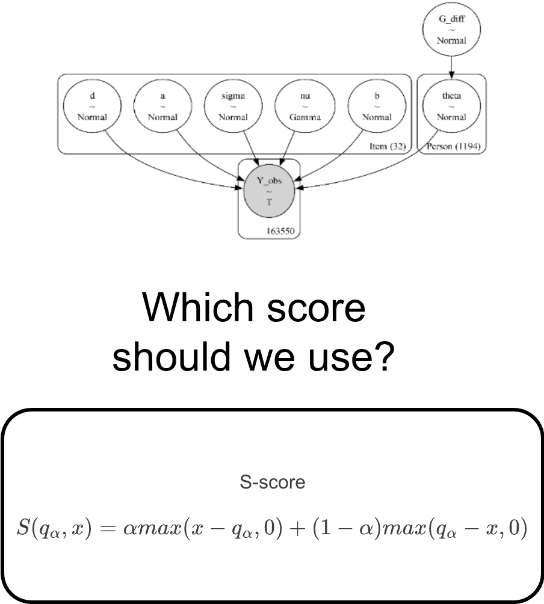

## The Forecasting Proficiency Test (FPT)

<!-- link: https://fabio-setti.netlify.app/presentations/bayes_may4_2026/main -->

```{r}
library(ggplot2)

theme_set(theme_classic(base_size = 16, accent = "#7a0b80",
                        base_family = 'serif'))

```

:::: {.columns}
::: {.column width = '60%'}


The Forecasting proficiency test [FPT\; @Himmelstein_etal_2025] is test designed to identify skilled forecasters 🔮 


::: {.fragment fragment-index=1}

In general forecasting involves asking individuals to make predictions about future events and evaluating how accurate they are!

:::

::: {.fragment fragment-index=2}

The FPT lasts around 1 hour and presents both cognitive tasks and forecasting questions (the focus of this presentation).

:::


</br>

<center>

::: {.fragment fragment-index=3}

<p style='font-size: 32px'> Turns out there are many ways of asking for forecasts 🤔 </p>

:::

</br>

::: {.fragment fragment-index=4}

 <p style='font-size: 32px'> **quantile elicitation format (QEF)** VS probability elicitation format (PEF). </p>

:::

</center>


:::
::: {.column width = '40%'}

<center>


<div style="display:flex; font-size:26px;">
<figure>
  
  <figcaption>Mark Himmelstein, assistant professor </br> at Georgia Tech, PQP graduate </figcaption>
</figure>
</div>

</center>

:::
::::


## Comparison of PEF and QEF Question

:::: {.columns}
::: {.column width = '50%'}

<center>
Probability elicitation format
</center>

:::
::: {.column width = '50%'}


Quantile elicitation format

:::
::::

<center>  
{width="1000"}
</center>


##


:::: {.columns}
::: {.column width = '50%'}

<center>
<p style='font-size: 40px'> **Survey link** </p>

{target='_blank'}](Additional%20files/Images/SurveyQR.svg){width=500}
</center>


:::
::: {.column width = '50%'}

</br>

<center>  

{width=436.2612}

</center>

:::
::::


##

:::: {.columns}
::: {.column width = '55%'}


</br>
</br>
</br>
</br>
</br>

<center>

 <p style='font-size: 142px'> Thoughts?   </p>

</center>

:::
::: {.column width = '45%'}

</br>

<center>

{width=420}

</center>

:::
::::


##


<div style="position: absolute; top:25%; left:0%; width:"1300px">
  
</div>

## 


<div style="position: absolute; top:25%; left:0%; width:"1400px">
  
</div>

## 

<div style="position: absolute; top:15%; left:0%; width:"1400px">
  
</div>


## 


{.absolute top=250 left=500 width="250" height="350"}

:::: {.columns}
::: {.column width = '50%'}


<center>

::: {.fragment fragment-index=1 .slideInLeft .slow}

{width=700}

:::

</center>

:::
::: {.column width = '50%'}


<center>

::: {.fragment fragment-index=2 .slideInRight .slower}

{width=700}

:::


</center>

:::
::::


## Psychometrics?

:::: {.columns}
::: {.column width="60%"}


</br>
<center> <div style="font-size: 32px"> One of the goals of *psychometrics* is uncovering the probabilistic process that <u>**causes**</u> item responses. </div> </center>

</br>

::: {.fragment fragment-index=1}


In general, (most) psychometric models are statistical models that predict item responses, and have the following properties:

- Include parameters defining **item properties**
- Include parameters defining **person properties**
- Allow for some **randomness** in item responses (random measurement error)
:::

::: {.fragment fragment-index=2}
<center>

<div style="padding-top:24px;"> **Item response theory** (IRT) models include all of these components. </div>


</center>

:::

:::
::: {.column width="40%"}

<center>

{width="60%"}
</center>

:::
::::


## A Classical IRT Model

According to this IRT model, the *probability* of a correct response to a binary item $i$ for person $j$ ($Y_{ij} = 1$) is: 

:::: {.columns}
::: {.column width="60%"}

<iframe class="stretch" width="100%" height="470px" src="https://quinix45.github.io/shinylive_apps/2PL_interactive/"> </iframe>

:::

::: {.column width="40%"}

$$P(Y_{ij} = 1|a_i,b_i,\theta_j) = \mathrm{logit}(a_i(\theta_j - b_i))$$

:::{.fragment fragment-index=1}
- $\theta_j$ is an unobserved person trait that explains why responses from the same individuals are similar to each other (i.e., **ability**)
:::

:::{.fragment fragment-index=2}

- $a_i$ and $b_i$ are characteristics that vary across items (e.g., items can be more or less difficult)

:::

:::
::::


##

</br>

<div style="width:"1300px">
  
</div>


</br>


**GOAL:** in IRT fashion, proposing a model that predict forecasts by accounting for both *person* and *item* features


## Historical Standardization 

Responses to FPT quantile forecast items are on very different scales (e.g. dollars/gallon, thousands of dollars, percentages,...). But to compare item properties, the forecasts must be on the same scale.


:::: {.columns}
::: {.column width="40%"}

::: {.fragment fragment-index=1}

<center>

**historically scaled signed error** 

</center>


$$ Y_i = \frac{\hat{Y}_i - Y_{\mathrm{res},i}}{SD_{Y_{\mathrm{hist},i}}}$$

<ul style="font-size: 26px">  

<li>  $\hat{Y}_i$: Reported forecast for item $i$ at any quantile.   </li>

<li>  $Y_{\mathrm{res},i}$: The resolution for item $i$.   </li>

<li>  $SD_{Y_{\mathrm{hist},i}}$: The $SD$ of the historical time series of item $i$.    </li>

</ul>

:::

:::
::: {.column width="60%"}

::: {.fragment fragment-index=2}
<center>

$Y_i$: SD units away from the resolution.

</center>

:::

::: {.r-stack}

::: {.fragment fragment-index=2}

```{r}
ggplot() +
  xlim(c(-3, 3)) +
  ylim(c(0, 5)) +
  xlab(expression(Y[i])) +
   geom_segment(aes(x = 0, xend = 0, y = 0, yend = 4), linetype = 2, 
                col = "#1b305c",
                size = 2)+
  annotate("text", x = -2, y = 1, label = "Perfect Forecast",
           size = 7) +
  theme(axis.ticks.y = element_blank(),
        axis.title.y =element_blank(),
        axis.line.y = element_blank(),
        axis.text.y =  element_blank())

```


:::

::: {.fragment fragment-index=3}

```{r}
ggplot() +
  xlim(c(-3, 3)) +
  ylim(c(0, 5)) +
  xlab(expression(Y[i])) +
   geom_segment(aes(x = 2, xend = 2, y = 0, yend = 4), linetype = 2,
                col = "#1b305c",
                size = 2)+
  annotate("text", x = 0, y = 1, label = "2 SD Above \n Resolution",
           size = 7) +
  theme(axis.ticks.y = element_blank(),
        axis.title.y =element_blank(),
        axis.line.y = element_blank(),
        axis.text.y =  element_blank())


```

:::

::: {.fragment fragment-index=4}

```{r}
ggplot() +
  xlim(c(-3, 3)) +
  ylim(c(0, 5)) +
  xlab(expression(Y[i])) +
   geom_segment(aes(x = -1, xend = -1, y = 0, yend = 4), linetype = 2,
                col = "#1b305c",
                size = 2)+
  annotate("text", x = 0, y = 1, label = "1 SD Below \n Resolution",
           size = 7) +
  theme(axis.ticks.y = element_blank(),
        axis.title.y =element_blank(),
        axis.line.y = element_blank(),
        axis.text.y =  element_blank())


```


:::

:::
:::

::::

## Determining a "correct" Response 🤔

For quantiles where $p \neq 0.5$, determining what a correct response should be is not straightforward. What is a "correct" response when $p = 0.05$? 

:::: {.columns}
::: {.column width = '50%'}

::: {.fragment fragment-index=1}

**wisdom of crowds** [WoC\; @Galton_1907]


:::

:::
::: {.column width = '50%'}

::: {.fragment fragment-index=2}


**cultural consensus theory** [e.g., @Anders_etal_2014]

A framework for determining a "correct" answer through consensus when no objective correct answer exists.


:::

:::
::::


## Modeling Signed Error


We model $Y_{jiq}$, the signed error of person $j$ to item $i$ at quantile $q$. 


:::: {.columns}

::: {.column width="40%"}


$$
Y_{jiq} \sim \mathrm{Student\ T}(\mu_{iq}, \sigma_{ji}, \mathrm{df}_i) \\
\mu_{iq} = b_i + Q_q \times d_i \\
\sigma_{ji} = \frac{\sigma_i}{\mathrm{Exp}[a_i \times \theta_j]}
$$

<ul style="font-size: 22px">  

::: {.fragment fragment-index=1}

<li>  $b_i$: item bias (*irreducible uncertainty*) </li>

:::


::: {.fragment fragment-index=2}

<li>  $d_i$: expected quantile distance. $Q_q$ is a vector of constants that ensures monotonicity of $\mu_{iq}$  </li>

:::

::: {.fragment fragment-index=3}

<li>  $\sigma_i$: item difficulty </li>

:::

::: {.fragment fragment-index=4}

<li>  $\theta_j$: Forecasting ability, the only **person parameter** in the model </li>

:::

::: {.fragment fragment-index=5}

<li>  $a_i$: item discrimination (i.e. the magnitude of the effect of $\theta_j$ on $\sigma_i$)  </li>

:::

</ul>

:::

::: {.column width="60%"}


<iframe class="stretch" width="100%" height="550px" src="https://quinix45.github.io/shinylive_apps/t_model/"> </iframe>

:::
::::


## Priors 

</br>

:::: {.columns}
::: {.column width = '50%'}


::: {.r-stack}

::: {.fragment fragment-index=1}


:::

::: {.fragment fragment-index=2}


:::


::: {.fragment fragment-index=3}


:::

::: {.fragment fragment-index=4}


:::


:::

:::
::: {.column width = '50%'}

::: {.r-stack}

::: {.fragment fragment-index=1}


:::

::: {.fragment fragment-index=2}


:::


::: {.fragment fragment-index=3}


:::

::: {.fragment fragment-index=4}


:::

:::


:::
::::

## Data Collection

Item forecasts were collected across 5 waves of a 7 Wave study. 

:::: {.columns}
::: {.column width="30%"}

</br>

<ul style="font-size: 28px">  

<li>  **32 items** divided across 6 forms (A, B, C, D, E, X)  and **1194 participants** </li>


::: {.fragment fragment-index=1}

<li> Diverse item domains: Financial, political, technology, energy... </li>

:::

::: {.fragment fragment-index=2}

<li> 1 week interval between waves, and 1 month from resolution at wave 7  </li>

:::
</ul>


</br>


:::
::: {.column width="70%"}


<div style="font-size: 16px"> *note*. The full experimental designed is detailed in both @Zhu_etal_2025 and @Himmelstein_etal_2025.</div>

:::
::::

## Software 

:::: {.columns}
::: {.column width = '30%'}

All models were estimated in `python` (Version 3.11) with `pymc` [@Abril-Pla_etal_2023] by using `nutpie`, an HMC sampler written in `rust` that improves on `stan`'s sampling algorithm [@Seyboldt_etal_2026 \;].

::: {.fragment fragment-index=1}

{width="320"}

:::

::: {.fragment fragment-index=2}

Plotting and analyses where done in `R` (Version 4.5.2). 

:::

:::
::: {.column width = '70%'}

<center>  
{width="880"}
</center>

:::
::::


## Posterior and Convergence Statistics


:::: {.columns}
::: {.column width = '30%'}

MCMC settings:

- 4 chains

  - 800 warmup iterations

  - 5000 draws


::: {.fragment fragment-index=1}

Around 16 minutes for the full model! (1,354 estimated parameters)

:::

</br>

::: {.fragment fragment-index=2}

Good convergence, although $\sigma_i$ parameters seem a bit harder to sample.

:::


:::
::: {.column width = '70%'}

::: {.fragment fragment-index=1}

```{r}

posterior_sum <- rio::import("Additional files/T_model_summary.csv")[,c(1,2, 3, 4, 5  , 8, 9, 10)]

colnames(posterior_sum) <- c("Parameter", "Mean", "SD", "2.5% HDI", "97.5% HDI", "ESS Bulk", "ESS Tail", "Rhat")

labels <- c("Parameter name",
            "Posterior mean",
            "Posterior standard deviation",
            "2.5% of highest posterior density interval",
            "97.5% of highest posterior density interval",
            "Bulk effective sample size",
            "Tail effective sample size",
            "Gelman-Rubin Rhat")

labels_react <- FabioFun::reactbl_col.desc(names = colnames(posterior_sum),
                                 desc =  labels,
                                 style = "cursor: pointer; text-decoration: none;",
                                 info_color = "#7a0b80")


library(reactable)

reactable(posterior_sum,
          defaultColDef = colDef(minWidth = 90),
          style = list(fontFamily = "Work Sans, sans-serif", fontSize = "1rem"),
          pagination = FALSE, highlight = TRUE, height = 600, columns = labels_react)
```


:::

:::
::::


## Estimated Item Parameters

:::: {.columns}
::: {.column width = '70%'}

{width="880"}

:::
::: {.column width = '30%'}

$$
Y_{jiq} \sim \mathrm{Student\ T}(\mu_{iq}, \sigma_{ji}, \mathrm{df}_i) \\
\mu_{iq} = b_i + Q_q \times d_i \\
\sigma_{ji} = \frac{\sigma_i}{\mathrm{Exp}[a_i \times \theta_j]}
$$


- The *dashed lines* represent the median of the item parameters.

- The *horizontal lines* represent the posterior SD.


<center>

::: {.fragment fragment-index=1}
Items can have very different properties!
:::

</center>

:::
::::


## Posterior Predictive Checks

:::: {.columns}
::: {.column width = '80%'}


<center>  
{width="980"}
</center> 

:::
::: {.column width = '20%'}


- The model predicts item responses fairly well across items


- The distribution of item responses varies greatly across items and the model accounts for that

::: {.fragment fragment-index=1}
- some bimodal strangeness 😧 (e.g., [Bitcoin Graph](https://www.blockchain.com/explorer/charts/hash-ratelink){target='_blank'})
:::

:::
::::

## $\theta$ Distribution


:::: {.columns}
::: {.column width = '70%'}

<center>  
{width="880"}
</center>

:::

::: {.column width = '30%'}

On top of the regular sample, 47 "super forecasters" were invited to complete all the FPT questions. 

::: {.fragment fragment-index=1}

<center>  
{width="110"}
</center>


$$
\bar{\theta}_{\mathrm{SF}} - \bar{\theta}_{\mathrm{REG}} =
$$

$$
0.75, 95\% \, \mathrm{HDI} [0.49; 1.00]
$$

:::

:::
::::

## Who gets Higher $\theta s$?

Forecasters who consistently approach the expected forecasts get higher $\theta$ values.

:::: {.columns}
::: {.column width="75%"}

<center>
{width=75%}
</center>

:::
::: {.column width="25%"}

<center>

<span style="color: blue;"> item expected forecasts </span> are defined in the models as 

</center>


$$
Y_{jiq} \sim \mathrm{Student\ T}(\mu_{iq}, \sigma_{ji}, \mathrm{df}_i) \\
\color{blue}{\mu_{iq} = b_i + Q_q \times d_i} \\
\sigma_{ji} = \frac{\sigma_i}{\mathrm{Exp}[a_i \times \theta_j]}
$$

:::
::::

<div style="font-size: 22px"> *note*. In the case of the two top panels, missing person forecast were outside the $Y_{jiq} = [-9; 9]$ range.</div>


## Different Approaches to Scoring

:::: {.columns}
::: {.column width = '50%'}

The forecasting folks are perfectly fine with this:


::: {.fragment fragment-index=1}

Psychometric folks prefer this: 


:::


:::

::: {.column width = '50%'}

::: {.fragment fragment-index=2}

In the case of item like the ones on the FPT, one popular scoring rule is the S-score [@Jose_Winkler_2009]


::: {.panel-tabset}

### 5%

{width=95%}

### 25%

{width=95%}

### 50%

{width=95%}

### 75%

{width=95%}

### 95%

{width=95%}

:::
:::

:::
::::


## How related are $\theta$ and *S*-scores?

:::: {.columns}
::: {.column width="30%"}

<div style="font-size: 26px"> As per the study pre-registration, Waves 1 and 7 responses were treated as *outcome* and Waves 2,4, 6 were treated as *predictors*. </div>


</br>

::: {.fragment fragment-index=1}

We refit the model and calculate both $\theta$ and the individual S-scores for Waves 1 and 7 and Waves 2,4, and 6 separately.


</br>

<div style="font-size: 24px; padding-top: 14px;"> \* **SS** stands for **S-Score**  </div>

:::


:::
::: {.column width="70%"}

::: {.fragment fragment-index=1}

{width=95%}

:::

:::
::::


## $\theta$ And S-scores?

:::: {.columns}
::: {.column width="50%"}


::: {.fragment fragment-index=1}

<center>
<figure>
  
  <figcaption style="font-size: 30px"> Magnus Carlsen, the best chess player in the world (highest $\theta$) </figcaption>
</figure>
</center>

:::

:::
::: {.column width="50%"}

::: {.fragment fragment-index=2}
<center>
<figure>
  <div class="tenor-gif-embed" 
       data-postid="16228483763522153196" 
       data-share-method="host" 
       data-aspect-ratio="1.1267" 
       data-width="80%">
    <a href="https://tenor.com/view/magnus-carlsen-magnus-slam-table-slam-angry-gif-16228483763522153196">
      Magnus Carlsen Slam GIF
    </a> 
    from 
    <a href="https://tenor.com/search/magnus+carlsen-gifs">Magnus Carlsen GIFs</a>
  </div>
  <script type="text/javascript" async src="https://tenor.com/embed.js"></script>
  <figcaption style="font-size: 30px">Magnus still loses every once in a while (i.e., lower S-score in some instances) </figcaption>
</figure>
</center>

:::
:::
::::


## 


{.absolute top=250 left=450 width="350" height="350"}

:::: {.columns}
::: {.column width = '50%'}


<center>

::: {.fragment fragment-index=1 .slideInLeft .slower}

{width=700}

:::

</center>

:::
::: {.column width = '50%'}


<center>

::: {.fragment fragment-index=2 .slideInRight .slower}

{width=700}

:::


</center>

:::
::::


## Summary


:::: {.columns}
::: {.column width = '50%'}


**Contributions:**


::: {.fragment fragment-index=1}

- Novel model for QEF items that measure item properties

:::


::: {.fragment fragment-index=2}

- A latent trait metric that represents forecasting ability and relates to conventional scoring rules

:::

**Limitations:**

::: {.fragment fragment-index=3}

- QEF items are very complex, some items present some irregularities that are not accounted by the model

:::


::: {.fragment fragment-index=4}

- Item properties may depend on the way in which the items are presented [e.g., @Crosetto_Haan_2023]

:::

:::
::: {.column width = '50%'}


::: {.r-stack}


::: {.fragment fragment-index=1 .fade-in-then-out}


:::

::: {.fragment fragment-index=2}


:::

::: {.fragment fragment-index=3}


:::

:::


:::
::::


## 


:::: {.columns}
::: {.column width = '50%'}

<center>
 <p style='font-size: 40px'>  **References** </p>

</center>

<div id="refs"> </div>

:::
::: {.column width = '50%'}

<center>

 <p style='font-size: 40px'>  **Slides link** </p>

{width=500}
</center>


:::
::::


## Item Prompts

<div style="
  max-height: 550px;
  overflow-y: auto;
  overflow-x: auto;
  padding: 10px;
">

<table style="width: 100%; border-collapse: collapse; font-size: 0.7em;">
  <caption style="caption-side: top; font-weight: bold; margin-bottom: 8px;">
    Item Prompts
  </caption>

  <thead>
    <tr>
      <th style="border: 1px solid black;">Item</th>
      <th style="border: 1px solid black;">ID</th>
      <th style="border: 1px solid black; text-align: left;">Question</th>
      <th style="border: 1px solid black;">Form</th>
    </tr>
  </thead>

  <tbody>
    <tr><td>1</td><td>G2346</td><td>What will be the average value of the FAO Meat Price Index in May 2024?</td><td>A</td></tr>
    <tr><td>2</td><td>G1472</td><td>What will be the annual inflation rate (%) for the Euro area in May 2024?</td><td>A</td></tr>
    <tr><td>3</td><td>M9971</td><td>Average PM2.5 (μg/m³) in Beijing for May 2024?</td><td>A</td></tr>
    <tr><td>4</td><td>G1948</td><td>Federal firearm background checks in the U.S. during May 2024?</td><td>A</td></tr>
    <tr><td>5</td><td>G2268</td><td>Southwest Land Border Encounters in the U.S. during May 2024?</td><td>A</td></tr>
    <tr><td>6</td><td>M3453</td><td>% of cyberattacks targeting public admin/defense in May 2024?</td><td>A</td></tr>

    <tr><td>7</td><td>G1189</td><td>Closing value for Dow Jones Transportation Average on May 31, 2024?</td><td>B</td></tr>
    <tr><td>8</td><td>G1631</td><td>Total Assets of the Federal Reserve on May 31, 2024?</td><td>B</td></tr>
    <tr><td>9</td><td>C1039</td><td>% of U.S. in severe drought (D2+) on May 31, 2024?</td><td>B</td></tr>
    <tr><td>10</td><td>M5680</td><td>% change in global CO₂ emissions (ground transport) in May 2024?</td><td>B</td></tr>
    <tr><td>11</td><td>G2063</td><td>NYC eviction filings in May 2024?</td><td>B</td></tr>
    <tr><td>12</td><td>G410</td><td>Migrants arriving in Europe by sea (May 2024)?</td><td>B</td></tr>

    <tr><td>13</td><td>M1571</td><td>Bitcoin hash rate (TH/s) on May 31, 2024?</td><td>C</td></tr>
    <tr><td>14</td><td>G1210</td><td>USD to RUB exchange rate on May 31, 2024?</td><td>C</td></tr>
    <tr><td>15</td><td>M7949</td><td>Arctic sea ice extent on May 31, 2024?</td><td>C</td></tr>
    <tr><td>16</td><td>M811</td><td># of magnitude 5+ earthquakes worldwide in May 2024?</td><td>C</td></tr>
    <tr><td>17</td><td>C47</td><td>O1 visas to Chinese nationals in May 2024?</td><td>C</td></tr>
    <tr><td>18</td><td>G2352</td><td>TSA travelers screened in May 2024?</td><td>C</td></tr>

    <tr><td>19</td><td>G1588</td><td>U.S. unemployment rate for May 2024?</td><td>D</td></tr>
    <tr><td>20</td><td>G1799</td><td>New housing units started in May 2024?</td><td>D</td></tr>
    <tr><td>21</td><td>G1920</td><td>U.S. box office gross in May 2024?</td><td>D</td></tr>
    <tr><td>22</td><td>M4663</td><td>Total minutes to listen to 80,000 Hours podcast (as of May 2024)?</td><td>D</td></tr>
    <tr><td>23</td><td>G2006</td><td>U.S. President approval rating on May 31, 2024?</td><td>D</td></tr>
    <tr><td>24</td><td>G938</td><td>Pro-Kremlin disinformation cases in May 2024?</td><td>D</td></tr>

    <tr><td>25</td><td>G2404</td><td>12-month % change in U.S. CPI (Food) for May 2024?</td><td>E</td></tr>
    <tr><td>26</td><td>G2341</td><td>Job quits (thousands) in May 2024?</td><td>E</td></tr>
    <tr><td>27</td><td>M6107</td><td># Amazon ratings for Harry Potter and the Deathly Hallows by May 31, 2024?</td><td>E</td></tr>
    <tr><td>28</td><td>G181</td><td>Worker protests recorded in China (May 2024)?</td><td>E</td></tr>
    <tr><td>29</td><td>M3924</td><td>Seattle Police total crime reports in May 2024?</td><td>E</td></tr>
    <tr><td>30</td><td>C1084</td><td>Autonomous vehicle collisions in California (May 2024)?</td><td>E</td></tr>

    <tr><td>31</td><td>G1190</td><td>U.S. gasoline price on May 31, 2024?</td><td>X</td></tr>
    <tr><td>32</td><td>M8907</td><td>Global commercial flights on May 31, 2024?</td><td>X</td></tr>
    <tr><td>33</td><td>G1294</td><td>PHEVs registered in the UK in May 2024?</td><td>X</td></tr>
    <tr><td>34</td><td>M5839</td><td>FDA approvals (NDAs + BLAs) in May 2024?</td><td>X</td></tr>
    <tr><td>35</td><td>G584</td><td>Russian government approval rating in May 2024?</td><td>X</td></tr>
    <tr><td>36</td><td>G794</td><td>Civilian deaths reported in Syria (May 2024)?</td><td>X</td></tr>
  </tbody>
</table>

<p style="margin-top: 8px; font-size: 0.6em;">
  <em>Note.</em> “Item” corresponds to numbering in the main text. “ID” matches labels used in Himmelstein et al. (2025).
</p>

</div>